# Healthcare System - Design Document

## 1. Design Services/Components

### 1.1 Microservices Architecture Overview

The Healthcare system is designed using a microservices architecture pattern with Django as the core framework. Each service is responsible for a specific domain and communicates through well-defined APIs.

```mermaid
graph TB
    %% External Layer
    Client[👥 Client Applications<br/>Web, Mobile, Desktop]
    
    %% API Gateway Layer
    Gateway[🌐 API Gateway<br/>Django Main Project<br/>- Request Routing<br/>- Authentication<br/>- Rate Limiting<br/>- Load Balancing]
    
    %% Authentication & Authorization
    AuthService[🔐 Authentication Service<br/>- JWT Token Management<br/>- User Registration<br/>- Password Hashing<br/>- Session Management]
    
    %% Core Business Services
    PatientService[👤 Patient Service<br/>- Patient Profile Management<br/>- Demographics<br/>- Emergency Contacts<br/>- Health Records]
    
    DoctorService[👨‍⚕️ Doctor Service<br/>- Doctor Profile Management<br/>- License Verification<br/>- Specialization Management<br/>- Approval Workflow]
    
    AppointmentService[📅 Appointment Service<br/>- Slot Management<br/>- Booking System<br/>- Calendar Integration<br/>- Status Tracking]
    
    SelfTestService[🧪 Self-Test Service<br/>- Symptom Collection<br/>- Test History<br/>- Risk Assessment<br/>- Report Generation]
    
    %% AI Services
    ChatbotService[🤖 AI Chatbot Service<br/>- Natural Language Processing<br/>- Doctor Recommendation<br/>- Symptom Analysis<br/>- Confidence Scoring]
    
    HealthAIService[🧠 Health AI Engine<br/>- Disease Prediction<br/>- Risk Stratification<br/>- Treatment Recommendations<br/>- Specialist Referrals]
    
    %% Data Services
    NotificationService[📧 Notification Service<br/>- Email Notifications<br/>- SMS Alerts<br/>- Push Notifications<br/>- Appointment Reminders]
    
    AuditService[📊 Audit Service<br/>- Activity Logging<br/>- Security Monitoring<br/>- Performance Metrics<br/>- Compliance Tracking]
    
    %% Data Layer
    Database[(🗄️ Primary Database<br/>PostgreSQL<br/>- User Data<br/>- Appointments<br/>- Medical Records)]
    
    Cache[(🔴 Cache Layer<br/>Redis<br/>- Session Storage<br/>- API Responses<br/>- Temporary Data)]
    
    FileStorage[(📁 File Storage<br/>AWS S3 / Local<br/>- Medical Documents<br/>- Profile Images<br/>- Reports)]
    
    KnowledgeBase[(📚 Knowledge Base<br/>JSON Files<br/>- Symptoms Database<br/>- Disease Information<br/>- Treatment Guidelines)]
    
    %% External Services
    EmailProvider[📮 Email Provider<br/>SendGrid / SMTP]
    SMSProvider[📱 SMS Provider<br/>Twilio / AWS SNS]
    
    %% Connections
    Client --> Gateway
    
    Gateway --> AuthService
    Gateway --> PatientService
    Gateway --> DoctorService
    Gateway --> AppointmentService
    Gateway --> SelfTestService
    Gateway --> NotificationService
    Gateway --> AuditService
    
    AppointmentService --> ChatbotService
    SelfTestService --> HealthAIService
    
    AuthService --> Database
    PatientService --> Database
    DoctorService --> Database
    AppointmentService --> Database
    SelfTestService --> Database
    
    ChatbotService --> Database
    HealthAIService --> KnowledgeBase
    
    Gateway --> Cache
    AuthService --> Cache
    
    NotificationService --> EmailProvider
    NotificationService --> SMSProvider
    
    PatientService --> FileStorage
    DoctorService --> FileStorage
    SelfTestService --> FileStorage
    
    AuditService --> Database
    
    %% Styling
    classDef client fill:#e8f5e8,stroke:#2e7d32,stroke-width:3px
    classDef gateway fill:#e3f2fd,stroke:#1976d2,stroke-width:3px
    classDef auth fill:#ffebee,stroke:#d32f2f,stroke-width:2px
    classDef core fill:#e1f5fe,stroke:#01579b,stroke-width:2px
    classDef ai fill:#f3e5f5,stroke:#4a148c,stroke-width:2px
    classDef support fill:#fff3e0,stroke:#e65100,stroke-width:2px
    classDef data fill:#fff8e1,stroke:#f9a825,stroke-width:2px
    classDef external fill:#fce4ec,stroke:#c2185b,stroke-width:2px
    
    class Client client
    class Gateway gateway
    class AuthService auth
    class PatientService,DoctorService,AppointmentService,SelfTestService core
    class ChatbotService,HealthAIService ai
    class NotificationService,AuditService support
    class Database,Cache,FileStorage,KnowledgeBase data
    class EmailProvider,SMSProvider external
```



### 1.2 Service Responsibilities

#### 1.2.1 API Gateway Service
**Purpose**: Central entry point for all client requests
- **Request Routing**: Direct requests to appropriate microservices
- **Authentication**: Validate JWT tokens and user sessions
- **Rate Limiting**: Prevent API abuse and ensure fair usage
- **Load Balancing**: Distribute requests across service instances
- **CORS Handling**: Manage cross-origin resource sharing
- **API Versioning**: Support multiple API versions

#### 1.2.2 Authentication Service
**Purpose**: Manage user authentication and authorization
- **User Registration**: Handle patient and doctor registration
- **Login/Logout**: Authenticate users and manage sessions
- **JWT Management**: Generate, validate, and refresh tokens
- **Password Security**: BCrypt hashing and validation
- **Role-Based Access**: Manage permissions for different user types
- **Account Recovery**: Password reset and account recovery

#### 1.2.3 Patient Service
**Purpose**: Manage patient-related data and operations
- **Profile Management**: Personal information, demographics
- **Health Records**: Medical history and health data
- **Emergency Contacts**: Contact information for emergencies
- **Appointment History**: Track patient's appointment records
- **Self-Test Results**: Store and manage test results
- **Privacy Controls**: Manage data sharing preferences

#### 1.2.4 Doctor Service
**Purpose**: Manage doctor-related data and operations
- **Professional Profiles**: Specialization, experience, credentials
- **License Management**: Verify and track medical licenses
- **Approval Workflow**: Admin approval process for new doctors
- **Availability Management**: Set working hours and availability
- **Patient Management**: Access to assigned patient information
- **Performance Analytics**: Track appointment statistics

#### 1.2.5 Appointment Service
**Purpose**: Handle appointment scheduling and management
- **Slot Management**: Create and manage appointment slots
- **Booking System**: Handle appointment reservations
- **Calendar Integration**: Sync with external calendar systems
- **Status Tracking**: Monitor appointment lifecycle
- **Conflict Resolution**: Prevent double-booking
- **Cancellation Handling**: Manage appointment cancellations

#### 1.2.6 Self-Test Service
**Purpose**: Manage health self-assessment functionality
- **Symptom Collection**: Gather and validate symptom data
- **Test Orchestration**: Coordinate different types of health tests
- **Result Processing**: Analyze and store test results
- **Risk Assessment**: Calculate health risk levels
- **Report Generation**: Create detailed health reports
- **History Tracking**: Maintain test history and trends

#### 1.2.7 AI Chatbot Service
**Purpose**: Provide intelligent appointment recommendations
- **Natural Language Processing**: Understand user symptom descriptions
- **Symptom Analysis**: Map symptoms to medical specializations
- **Doctor Matching**: Find suitable doctors based on criteria
- **Confidence Scoring**: Provide recommendation confidence levels
- **Conversation Management**: Maintain chat context and history
- **Learning Capabilities**: Improve recommendations over time

#### 1.2.8 Health AI Engine Service
**Purpose**: Advanced health analysis and prediction
- **Disease Prediction**: Analyze symptoms to predict conditions
- **Risk Stratification**: Categorize health risks (low/medium/high/urgent)
- **Treatment Recommendations**: Suggest appropriate treatments
- **Specialist Referrals**: Recommend appropriate medical specialists
- **Pattern Recognition**: Identify health trends and patterns
- **Knowledge Base Integration**: Utilize medical knowledge databases

### 1.3 Service Communication Patterns


## 2. Design Classes and Methods in Components

### 2.1 Patient Service Classes

```python
# patient/models.py
from django.db import models
from django.contrib.auth.models import User
from django.core.validators import RegexValidator
from datetime import date

class Patient(models.Model):
    """Patient model with comprehensive health information"""
    
    GENDER_CHOICES = [
        ('M', 'Male'),
        ('F', 'Female'),
        ('O', 'Other'),
        ('P', 'Prefer not to say'),
    ]
    
    BLOOD_TYPE_CHOICES = [
        ('A+', 'A Positive'),
        ('A-', 'A Negative'),
        ('B+', 'B Positive'),
        ('B-', 'B Negative'),
        ('AB+', 'AB Positive'),
        ('AB-', 'AB Negative'),
        ('O+', 'O Positive'),
        ('O-', 'O Negative'),
    ]
    
    # Core Identity
    user = models.OneToOneField(User, on_delete=models.CASCADE, related_name='patient_profile')
    patient_id = models.CharField(max_length=20, unique=True, editable=False)
    
    # Personal Information
    date_of_birth = models.DateField(null=True, blank=True)
    gender = models.CharField(max_length=1, choices=GENDER_CHOICES, blank=True)
    phone_regex = RegexValidator(regex=r'^\+?1?\d{9,15}$')
    phone = models.CharField(validators=[phone_regex], max_length=17, blank=True)
    address = models.TextField(blank=True)
    city = models.CharField(max_length=100, blank=True)
    state = models.CharField(max_length=100, blank=True)
    zip_code = models.CharField(max_length=10, blank=True)
    
    # Medical Information
    blood_type = models.CharField(max_length=3, choices=BLOOD_TYPE_CHOICES, blank=True)
    allergies = models.TextField(blank=True, help_text="List known allergies")
    chronic_conditions = models.TextField(blank=True, help_text="List chronic medical conditions")
    current_medications = models.TextField(blank=True, help_text="List current medications")
    
    # Emergency Contact
    emergency_contact_name = models.CharField(max_length=100, blank=True)
    emergency_contact_relationship = models.CharField(max_length=50, blank=True)
    emergency_contact_phone = models.CharField(validators=[phone_regex], max_length=17, blank=True)
    
    # Insurance Information
    insurance_provider = models.CharField(max_length=100, blank=True)
    insurance_policy_number = models.CharField(max_length=50, blank=True)
    
    # Privacy Settings
    data_sharing_consent = models.BooleanField(default=False)
    marketing_consent = models.BooleanField(default=False)
    
    # Metadata
    created_at = models.DateTimeField(auto_now_add=True)
    updated_at = models.DateTimeField(auto_now=True)
    is_active = models.BooleanField(default=True)
    
    class Meta:
        verbose_name = "Patient"
        verbose_name_plural = "Patients"
        ordering = ['-created_at']
    
    def __str__(self):
        return f"{self.user.get_full_name()} ({self.patient_id})"
    
    def save(self, *args, **kwargs):
        if not self.patient_id:
            self.patient_id = self.generate_patient_id()
        super().save(*args, **kwargs)
    
    def generate_patient_id(self):
        """Generate unique patient ID"""
        import uuid
        return f"PAT{uuid.uuid4().hex[:8].upper()}"
    
    @property
    def age(self):
        """Calculate patient age"""
        if self.date_of_birth:
            today = date.today()
            return today.year - self.date_of_birth.year - (
                (today.month, today.day) < (self.date_of_birth.month, self.date_of_birth.day)
            )
        return None
    
    @property
    def full_address(self):
        """Get formatted full address"""
        parts = [self.address, self.city, self.state, self.zip_code]
        return ", ".join(filter(None, parts))
    
    def get_recent_appointments(self, limit=5):
        """Get recent appointments for this patient"""
        return self.appointments.select_related('doctor__user').order_by('-appointment_date')[:limit]
    
    def get_health_summary(self):
        """Get comprehensive health summary"""
        return {
            'age': self.age,
            'blood_type': self.get_blood_type_display(),
            'allergies': self.allergies.split('\n') if self.allergies else [],
            'chronic_conditions': self.chronic_conditions.split('\n') if self.chronic_conditions else [],
            'current_medications': self.current_medications.split('\n') if self.current_medications else [],
            'recent_tests': self.self_tests.order_by('-created_at')[:3],
            'upcoming_appointments': self.appointments.filter(
                appointment_date__gte=timezone.now()
            ).order_by('appointment_date')[:3]
        }

# patient/services.py
from django.core.exceptions import ValidationError
from django.db import transaction
from .models import Patient

class PatientService:
    """Service class for patient-related operations"""
    
    @staticmethod
    def create_patient_profile(user, profile_data):
        """Create a new patient profile"""
        try:
            with transaction.atomic():
                patient = Patient.objects.create(
                    user=user,
                    **profile_data
                )
                return patient
        except Exception as e:
            raise ValidationError(f"Failed to create patient profile: {str(e)}")
    
    @staticmethod
    def update_patient_profile(patient_id, update_data):
        """Update patient profile information"""
        try:
            patient = Patient.objects.get(id=patient_id)
            for field, value in update_data.items():
                if hasattr(patient, field):
                    setattr(patient, field, value)
            patient.save()
            return patient
        except Patient.DoesNotExist:
            raise ValidationError("Patient not found")
    
    @staticmethod
    def get_patient_dashboard_data(patient_id):
        """Get comprehensive dashboard data for patient"""
        try:
            patient = Patient.objects.select_related('user').get(id=patient_id)
            return {
                'profile': patient,
                'health_summary': patient.get_health_summary(),
                'recent_appointments': patient.get_recent_appointments(),
                'test_history': patient.self_tests.order_by('-created_at')[:5],
                'notifications': patient.get_unread_notifications()
            }
        except Patient.DoesNotExist:
            raise ValidationError("Patient not found")
    
    @staticmethod
    def search_patients(query, limit=10):
        """Search patients by name, email, or patient ID"""
        from django.db.models import Q
        return Patient.objects.filter(
            Q(user__first_name__icontains=query) |
            Q(user__last_name__icontains=query) |
            Q(user__email__icontains=query) |
            Q(patient_id__icontains=query)
        ).select_related('user')[:limit]
    
    @staticmethod
    def validate_patient_data(data):
        """Validate patient profile data"""
        errors = {}
        
        if 'date_of_birth' in data and data['date_of_birth']:
            if data['date_of_birth'] > date.today():
                errors['date_of_birth'] = "Date of birth cannot be in the future"
        
        if 'phone' in data and data['phone']:
            import re
            if not re.match(r'^\+?1?\d{9,15}$', data['phone']):
                errors['phone'] = "Invalid phone number format"
        
        if errors:
            raise ValidationError(errors)
        
        return True

# patient/views.py
from rest_framework import viewsets, status
from rest_framework.decorators import action
from rest_framework.response import Response
from rest_framework.permissions import IsAuthenticated
from .models import Patient
from .services import PatientService
from .serializers import PatientSerializer

class PatientViewSet(viewsets.ModelViewSet):
    """ViewSet for patient operations"""
    
    queryset = Patient.objects.all()
    serializer_class = PatientSerializer
    permission_classes = [IsAuthenticated]
    
    def get_queryset(self):
        """Filter queryset based on user permissions"""
        user = self.request.user
        if hasattr(user, 'patient_profile'):
            return Patient.objects.filter(id=user.patient_profile.id)
        elif hasattr(user, 'doctor_profile'):
            # Doctors can see their patients
            return Patient.objects.filter(
                appointments__doctor=user.doctor_profile
            ).distinct()
        return Patient.objects.none()
    
    @action(detail=False, methods=['get'])
    def dashboard(self, request):
        """Get patient dashboard data"""
        try:
            patient = request.user.patient_profile
            dashboard_data = PatientService.get_patient_dashboard_data(patient.id)
            return Response(dashboard_data)
        except AttributeError:
            return Response(
                {'error': 'Patient profile not found'}, 
                status=status.HTTP_404_NOT_FOUND
            )
    
    @action(detail=False, methods=['post'])
    def update_profile(self, request):
        """Update patient profile"""
        try:
            patient = request.user.patient_profile
            PatientService.validate_patient_data(request.data)
            updated_patient = PatientService.update_patient_profile(
                patient.id, request.data
            )
            serializer = self.get_serializer(updated_patient)
            return Response(serializer.data)
        except ValidationError as e:
            return Response(
                {'error': str(e)}, 
                status=status.HTTP_400_BAD_REQUEST
            )
    
    @action(detail=False, methods=['get'])
    def health_summary(self, request):
        """Get patient health summary"""
        try:
            patient = request.user.patient_profile
            health_summary = patient.get_health_summary()
            return Response(health_summary)
        except AttributeError:
            return Response(
                {'error': 'Patient profile not found'}, 
                status=status.HTTP_404_NOT_FOUND
            )
```

### 2.2 Doctor Service Classes

```python
# doctor/models.py
from django.db import models
from django.contrib.auth.models import User
from django.core.validators import MinValueValidator, MaxValueValidator
from decimal import Decimal

class Doctor(models.Model):
    """Doctor model with professional information"""
    
    APPROVAL_STATUS_CHOICES = [
        ('pending', 'Pending Approval'),
        ('approved', 'Approved'),
        ('rejected', 'Rejected'),
        ('suspended', 'Suspended'),
    ]
    
    SPECIALIZATION_CHOICES = [
        ('cardiology', 'Cardiology'),
        ('dermatology', 'Dermatology'),
        ('endocrinology', 'Endocrinology'),
        ('gastroenterology', 'Gastroenterology'),
        ('general_medicine', 'General Medicine'),
        ('neurology', 'Neurology'),
        ('oncology', 'Oncology'),
        ('orthopedics', 'Orthopedics'),
        ('pediatrics', 'Pediatrics'),
        ('psychiatry', 'Psychiatry'),
        ('pulmonology', 'Pulmonology'),
        ('radiology', 'Radiology'),
        ('surgery', 'Surgery'),
        ('urology', 'Urology'),
    ]
    
    # Core Identity
    user = models.OneToOneField(User, on_delete=models.CASCADE, related_name='doctor_profile')
    doctor_id = models.CharField(max_length=20, unique=True, editable=False)
    
    # Professional Information
    specialization = models.CharField(max_length=50, choices=SPECIALIZATION_CHOICES)
    sub_specialization = models.CharField(max_length=100, blank=True)
    license_number = models.CharField(max_length=50, unique=True)
    license_expiry_date = models.DateField(null=True, blank=True)
    medical_school = models.CharField(max_length=200, blank=True)
    graduation_year = models.IntegerField(
        validators=[MinValueValidator(1950), MaxValueValidator(2030)],
        null=True, blank=True
    )
    
    # Experience and Qualifications
    experience_years = models.IntegerField(
        validators=[MinValueValidator(0), MaxValueValidator(70)],
        default=0
    )
    board_certifications = models.TextField(blank=True, help_text="List board certifications")
    languages_spoken = models.CharField(max_length=200, blank=True)
    
    # Contact Information
    phone_regex = RegexValidator(regex=r'^\+?1?\d{9,15}$')
    phone = models.CharField(validators=[phone_regex], max_length=17, blank=True)
    office_address = models.TextField(blank=True)
    consultation_fee = models.DecimalField(
        max_digits=8, decimal_places=2, 
        default=Decimal('0.00'), blank=True
    )
    
    # Approval and Status
    approval_status = models.CharField(
        max_length=20, choices=APPROVAL_STATUS_CHOICES, default='pending'
    )
    approved_by = models.ForeignKey(
        User, on_delete=models.SET_NULL, null=True, blank=True,
        related_name='approved_doctors'
    )
    approved_at = models.DateTimeField(null=True, blank=True)
    rejection_reason = models.TextField(blank=True)
    
    # Professional Settings
    accepts_new_patients = models.BooleanField(default=True)
    telemedicine_available = models.BooleanField(default=False)
    emergency_consultations = models.BooleanField(default=False)
    
    # Ratings and Reviews
    average_rating = models.DecimalField(
        max_digits=3, decimal_places=2, default=Decimal('0.00')
    )
    total_reviews = models.IntegerField(default=0)
    
    # Metadata
    created_at = models.DateTimeField(auto_now_add=True)
    updated_at = models.DateTimeField(auto_now=True)
    last_login = models.DateTimeField(null=True, blank=True)
    
    class Meta:
        verbose_name = "Doctor"
        verbose_name_plural = "Doctors"
        ordering = ['-created_at']
    
    def __str__(self):
        status_indicator = {
            'approved': '✓',
            'pending': '⏳',
            'rejected': '✗',
            'suspended': '⚠️'
        }.get(self.approval_status, '?')
        return f"{status_indicator} Dr. {self.user.get_full_name()} - {self.get_specialization_display()}"
    
    def save(self, *args, **kwargs):
        if not self.doctor_id:
            self.doctor_id = self.generate_doctor_id()
        super().save(*args, **kwargs)
    
    def generate_doctor_id(self):
        """Generate unique doctor ID"""
        import uuid
        return f"DOC{uuid.uuid4().hex[:8].upper()}"
    
    @property
    def is_approved(self):
        """Check if doctor is approved"""
        return self.approval_status == 'approved'
    
    @property
    def full_name_with_title(self):
        """Get full name with Dr. title"""
        return f"Dr. {self.user.get_full_name()}"
    
    def get_availability_summary(self):
        """Get doctor's availability summary"""
        from datetime import date, timedelta
        today = date.today()
        next_week = today + timedelta(days=7)
        
        total_slots = self.appointment_slots.filter(
            date__range=[today, next_week]
        ).count()
        
        available_slots = self.appointment_slots.filter(
            date__range=[today, next_week],
            appointment__isnull=True
        ).count()
        
        return {
            'total_slots_next_week': total_slots,
            'available_slots_next_week': available_slots,
            'booking_rate': ((total_slots - available_slots) / total_slots * 100) if total_slots > 0 else 0
        }
    
    def get_patient_statistics(self):
        """Get doctor's patient statistics"""
        return {
            'total_patients': self.appointments.values('patient').distinct().count(),
            'total_appointments': self.appointments.count(),
            'completed_appointments': self.appointments.filter(status='completed').count(),
            'average_rating': float(self.average_rating),
            'total_reviews': self.total_reviews
        }

# doctor/services.py
from django.core.exceptions import ValidationError
from django.db import transaction
from django.utils import timezone
from .models import Doctor

class DoctorService:
    """Service class for doctor-related operations"""
    
    @staticmethod
    def create_doctor_profile(user, profile_data):
        """Create a new doctor profile"""
        try:
            with transaction.atomic():
                # Validate license number uniqueness
                if Doctor.objects.filter(license_number=profile_data.get('license_number')).exists():
                    raise ValidationError("License number already exists")
                
                doctor = Doctor.objects.create(
                    user=user,
                    **profile_data
                )
                return doctor
        except Exception as e:
            raise ValidationError(f"Failed to create doctor profile: {str(e)}")
    
    @staticmethod
    def approve_doctor(doctor_id, approved_by_user, approval_notes=""):
        """Approve a doctor's registration"""
        try:
            with transaction.atomic():
                doctor = Doctor.objects.get(id=doctor_id)
                doctor.approval_status = 'approved'
                doctor.approved_by = approved_by_user
                doctor.approved_at = timezone.now()
                doctor.save()
                
                # Send approval notification
                NotificationService.send_doctor_approval_notification(doctor)
                
                return doctor
        except Doctor.DoesNotExist:
            raise ValidationError("Doctor not found")
    
    @staticmethod
    def reject_doctor(doctor_id, rejected_by_user, rejection_reason):
        """Reject a doctor's registration"""
        try:
            with transaction.atomic():
                doctor = Doctor.objects.get(id=doctor_id)
                doctor.approval_status = 'rejected'
                doctor.approved_by = rejected_by_user
                doctor.rejection_reason = rejection_reason
                doctor.save()
                
                # Send rejection notification
                NotificationService.send_doctor_rejection_notification(doctor, rejection_reason)
                
                return doctor
        except Doctor.DoesNotExist:
            raise ValidationError("Doctor not found")
    
    @staticmethod
    def get_doctor_dashboard_data(doctor_id):
        """Get comprehensive dashboard data for doctor"""
        try:
            doctor = Doctor.objects.select_related('user').get(id=doctor_id)
            return {
                'profile': doctor,
                'availability_summary': doctor.get_availability_summary(),
                'patient_statistics': doctor.get_patient_statistics(),
                'recent_appointments': doctor.appointments.select_related('patient__user').order_by('-appointment_date')[:5],
                'pending_appointments': doctor.appointments.filter(status='scheduled').count(),
                'today_appointments': doctor.appointment_slots.filter(
                    date=timezone.now().date(),
                    appointment__isnull=False
                ).count()
            }
        except Doctor.DoesNotExist:
            raise ValidationError("Doctor not found")
    
    @staticmethod
    def search_doctors(query, specialization=None, location=None, limit=10):
        """Search doctors with filters"""
        from django.db.models import Q
        
        queryset = Doctor.objects.filter(approval_status='approved')
        
        if query:
            queryset = queryset.filter(
                Q(user__first_name__icontains=query) |
                Q(user__last_name__icontains=query) |
                Q(specialization__icontains=query) |
                Q(sub_specialization__icontains=query)
            )
        
        if specialization:
            queryset = queryset.filter(specialization=specialization)
        
        if location:
            queryset = queryset.filter(office_address__icontains=location)
        
        return queryset.select_related('user').order_by('-average_rating', '-experience_years')[:limit]
    
    @staticmethod
    def update_doctor_rating(doctor_id, new_rating):
        """Update doctor's average rating"""
        try:
            doctor = Doctor.objects.get(id=doctor_id)
            
            # Calculate new average rating
            total_rating_points = doctor.average_rating * doctor.total_reviews + new_rating
            doctor.total_reviews += 1
            doctor.average_rating = total_rating_points / doctor.total_reviews
            
            doctor.save()
            return doctor
        except Doctor.DoesNotExist:
            raise ValidationError("Doctor not found")
```

### 2.3 Appointment Service Classes

```python
# appointment/models.py
from django.db import models
from django.core.exceptions import ValidationError
from datetime import time, datetime, timedelta
from django.utils import timezone

class AppointmentSlot(models.Model):
    """Available appointment slots created by doctors"""
    
    SLOT_CHOICES = [
        ('morning_1', 'Morning 8:00 - 9:30'),
        ('morning_2', 'Morning 10:00 - 11:30'),
        ('afternoon_1', 'Afternoon 1:30 - 3:00'),
        ('afternoon_2', 'Afternoon 3:30 - 5:00'),
        ('evening_1', 'Evening 6:00 - 7:30'),
        ('evening_2', 'Evening 8:00 - 9:30'),
    ]
    
    SLOT_TIMES = {
        'morning_1': (time(8, 0), time(9, 30)),
        'morning_2': (time(10, 0), time(11, 30)),
        'afternoon_1': (time(13, 30), time(15, 0)),
        'afternoon_2': (time(15, 30), time(17, 0)),
        'evening_1': (time(18, 0), time(19, 30)),
        'evening_2': (time(20, 0), time(21, 30)),
    }
    
    # Core Fields
    doctor = models.ForeignKey('doctor.Doctor', on_delete=models.CASCADE, related_name='appointment_slots')
    date = models.DateField()
    slot_type = models.CharField(max_length=20, choices=SLOT_CHOICES)
    is_available = models.BooleanField(default=True)
    is_emergency_slot = models.BooleanField(default=False)
    consultation_type = models.CharField(
        max_length=20,
        choices=[('in_person', 'In Person'), ('telemedicine', 'Telemedicine')],
        default='in_person'
    )
    
    # Pricing
    consultation_fee = models.DecimalField(max_digits=8, decimal_places=2, null=True, blank=True)
    
    # Metadata
    created_at = models.DateTimeField(auto_now_add=True)
    updated_at = models.DateTimeField(auto_now=True)
    
    class Meta:
        unique_together = ['doctor', 'date', 'slot_type']
        verbose_name = "Appointment Slot"
        verbose_name_plural = "Appointment Slots"
        ordering = ['date', 'slot_type']
    
    def __str__(self):
        return f"Dr. {self.doctor.user.get_full_name()} - {self.date} {self.get_slot_type_display()}"
    
    def clean(self):
        """Validate appointment slot"""
        if self.date and self.date < timezone.now().date():
            raise ValidationError("Cannot create slots for past dates")
    
    @property
    def start_time(self):
        """Get slot start time"""
        return self.SLOT_TIMES[self.slot_type][0]
    
    @property
    def end_time(self):
        """Get slot end time"""
        return self.SLOT_TIMES[self.slot_type][1]
    
    @property
    def datetime_start(self):
        """Get slot start datetime"""
        return timezone.datetime.combine(self.date, self.start_time)
    
    @property
    def datetime_end(self):
        """Get slot end datetime"""
        return timezone.datetime.combine(self.date, self.end_time)
    
    @property
    def is_booked(self):
        """Check if slot is booked"""
        return hasattr(self, 'appointment') and self.appointment is not None
    
    @property
    def duration_minutes(self):
        """Get slot duration in minutes"""
        start_dt = datetime.combine(datetime.today(), self.start_time)
        end_dt = datetime.combine(datetime.today(), self.end_time)
        return int((end_dt - start_dt).total_seconds() / 60)

class Appointment(models.Model):
    """Appointment booking model"""
    
    STATUS_CHOICES = [
        ('scheduled', 'Scheduled'),
        ('confirmed', 'Confirmed'),
        ('in_progress', 'In Progress'),
        ('completed', 'Completed'),
        ('cancelled', 'Cancelled'),
        ('no_show', 'No Show'),
        ('rescheduled', 'Rescheduled'),
    ]
    
    PRIORITY_CHOICES = [
        ('low', 'Low'),
        ('normal', 'Normal'),
        ('high', 'High'),
        ('urgent', 'Urgent'),
    ]
    
    # Core Relationships
    patient = models.ForeignKey('patient.Patient', on_delete=models.CASCADE, related_name='appointments')
    doctor = models.ForeignKey('doctor.Doctor', on_delete=models.CASCADE, related_name='appointments')
    appointment_slot = models.OneToOneField(AppointmentSlot, on_delete=models.CASCADE, related_name='appointment')
    
    # Appointment Details
    appointment_date = models.DateTimeField()
    duration_minutes = models.IntegerField(default=90)
    status = models.CharField(max_length=20, choices=STATUS_CHOICES, default='scheduled')
    priority = models.CharField(max_length=10, choices=PRIORITY_CHOICES, default='normal')
    
    # Medical Information
    chief_complaint = models.TextField(help_text="Primary reason for visit")
    symptoms = models.TextField(blank=True, help_text="Detailed symptoms")
    medical_history_notes = models.TextField(blank=True)
    
    # Consultation Details
    consultation_type = models.CharField(
        max_length=20,
        choices=[('in_person', 'In Person'), ('telemedicine', 'Telemedicine')],
        default='in_person'
    )
    consultation_fee = models.DecimalField(max_digits=8, decimal_places=2, null=True, blank=True)
    
    # Follow-up Information
    follow_up_required = models.BooleanField(default=False)
    follow_up_date = models.DateField(null=True, blank=True)
    follow_up_notes = models.TextField(blank=True)
    
    # Doctor's Notes (filled during/after appointment)
    diagnosis = models.TextField(blank=True)
    treatment_plan = models.TextField(blank=True)
    prescriptions = models.TextField(blank=True)
    doctor_notes = models.TextField(blank=True)
    
    # Cancellation Information
    cancelled_at = models.DateTimeField(null=True, blank=True)
    cancelled_by = models.ForeignKey(
        'auth.User', on_delete=models.SET_NULL, null=True, blank=True,
        related_name='cancelled_appointments'
    )
    cancellation_reason = models.TextField(blank=True)
    
    # Metadata
    created_at = models.DateTimeField(auto_now_add=True)
    updated_at = models.DateTimeField(auto_now=True)
    
    class Meta:
        verbose_name = "Appointment"
        verbose_name_plural = "Appointments"
        ordering = ['-appointment_date']
    
    def __str__(self):
        return f"{self.patient.user.get_full_name()} with Dr. {self.doctor.user.get_full_name()} on {self.appointment_date.strftime('%Y-%m-%d %H:%M')}"
    
    def clean(self):
        """Validate appointment"""
        if self.appointment_date and self.appointment_date < timezone.now():
            raise ValidationError("Cannot schedule appointments in the past")
        
        if self.follow_up_date and self.follow_up_date <= timezone.now().date():
            raise ValidationError("Follow-up date must be in the future")
    
    @property
    def can_be_cancelled(self):
        """Check if appointment can be cancelled (2 hours before)"""
        if self.status in ['cancelled', 'completed', 'no_show']:
            return False
        
        cancellation_deadline = self.appointment_date - timedelta(hours=2)
        return timezone.now() < cancellation_deadline
    
    @property
    def time_until_appointment(self):
        """Get time until appointment"""
        if self.appointment_date > timezone.now():
            delta = self.appointment_date - timezone.now()
            return delta
        return None
    
    def cancel_appointment(self, cancelled_by, reason=""):
        """Cancel the appointment"""
        if not self.can_be_cancelled:
            raise ValidationError("Appointment cannot be cancelled at this time")
        
        self.status = 'cancelled'
        self.cancelled_at = timezone.now()
        self.cancelled_by = cancelled_by
        self.cancellation_reason = reason
        self.save()
        
        # Make slot available again
        self.appointment_slot.is_available = True
        self.appointment_slot.save()

# appointment/services.py
from django.core.exceptions import ValidationError
from django.db import transaction
from django.utils import timezone
from datetime import date, timedelta
from .models import AppointmentSlot, Appointment

class AppointmentService:
    """Service class for appointment-related operations"""
    
    @staticmethod
    def create_appointment_slots(doctor, date_range, slot_types, consultation_type='in_person'):
        """Create multiple appointment slots for a doctor"""
        try:
            with transaction.atomic():
                slots_created = []
                
                for single_date in date_range:
                    for slot_type in slot_types:
                        # Check if slot already exists
                        if not AppointmentSlot.objects.filter(
                            doctor=doctor, date=single_date, slot_type=slot_type
                        ).exists():
                            slot = AppointmentSlot.objects.create(
                                doctor=doctor,
                                date=single_date,
                                slot_type=slot_type,
                                consultation_type=consultation_type,
                                consultation_fee=doctor.consultation_fee
                            )
                            slots_created.append(slot)
                
                return slots_created
        except Exception as e:
            raise ValidationError(f"Failed to create appointment slots: {str(e)}")
    
    @staticmethod
    def book_appointment(patient, slot_id, appointment_data):
        """Book an appointment for a patient"""
        try:
            with transaction.atomic():
                slot = AppointmentSlot.objects.select_for_update().get(
                    id=slot_id, is_available=True
                )
                
                # Check if slot is still available
                if hasattr(slot, 'appointment'):
                    raise ValidationError("Slot is no longer available")
                
                # Create appointment
                appointment = Appointment.objects.create(
                    patient=patient,
                    doctor=slot.doctor,
                    appointment_slot=slot,
                    appointment_date=slot.datetime_start,
                    consultation_type=slot.consultation_type,
                    consultation_fee=slot.consultation_fee,
                    **appointment_data
                )
                
                # Mark slot as unavailable
                slot.is_available = False
                slot.save()
                
                # Send confirmation notifications
                NotificationService.send_appointment_confirmation(appointment)
                
                return appointment
        except AppointmentSlot.DoesNotExist:
            raise ValidationError("Appointment slot not found or not available")
    
    @staticmethod
    def cancel_appointment(appointment_id, cancelled_by, reason=""):
        """Cancel an appointment"""
        try:
            appointment = Appointment.objects.get(id=appointment_id)
            appointment.cancel_appointment(cancelled_by, reason)
            
            # Send cancellation notifications
            NotificationService.send_appointment_cancellation(appointment)
            
            return appointment
        except Appointment.DoesNotExist:
            raise ValidationError("Appointment not found")
    
    @staticmethod
    def get_available_slots(doctor_id=None, date_range=None, consultation_type=None):
        """Get available appointment slots with filters"""
        queryset = AppointmentSlot.objects.filter(
            is_available=True,
            date__gte=timezone.now().date()
        ).select_related('doctor__user')
        
        if doctor_id:
            queryset = queryset.filter(doctor_id=doctor_id)
        
        if date_range:
            queryset = queryset.filter(date__range=date_range)
        
        if consultation_type:
            queryset = queryset.filter(consultation_type=consultation_type)
        
        return queryset.order_by('date', 'slot_type')
    
    @staticmethod
    def get_doctor_schedule(doctor_id, date_range):
        """Get doctor's complete schedule for date range"""
        slots = AppointmentSlot.objects.filter(
            doctor_id=doctor_id,
            date__range=date_range
        ).prefetch_related('appointment__patient__user').order_by('date', 'slot_type')
        
        schedule = {}
        for slot in slots:
            date_str = slot.date.strftime('%Y-%m-%d')
            if date_str not in schedule:
                schedule[date_str] = []
            
            slot_data = {
                'slot': slot,
                'is_booked': slot.is_booked,
                'appointment': slot.appointment if slot.is_booked else None
            }
            schedule[date_str].append(slot_data)
        
        return schedule
    
    @staticmethod
    def reschedule_appointment(appointment_id, new_slot_id):
        """Reschedule an appointment to a new slot"""
        try:
            with transaction.atomic():
                appointment = Appointment.objects.get(id=appointment_id)
                new_slot = AppointmentSlot.objects.select_for_update().get(
                    id=new_slot_id, is_available=True
                )
                
                # Free up old slot
                old_slot = appointment.appointment_slot
                old_slot.is_available = True
                old_slot.save()
                
                # Update appointment
                appointment.appointment_slot = new_slot
                appointment.appointment_date = new_slot.datetime_start
                appointment.status = 'rescheduled'
                appointment.save()
                
                # Mark new slot as unavailable
                new_slot.is_available = False
                new_slot.save()
                
                # Send notifications
                NotificationService.send_appointment_reschedule(appointment)
                
                return appointment
        except (Appointment.DoesNotExist, AppointmentSlot.DoesNotExist):
            raise ValidationError("Appointment or slot not found")
```

### 2.4 AI Services Classes

```python
# appointment/chatbot.py
import json
import re
from typing import List, Dict, Tuple
from django.conf import settings
from doctor.models import Doctor
from django.db.models import Q

class AppointmentChatbot:
    """Advanced AI Chatbot for appointment recommendations"""
    
    def __init__(self):
        self.disease_specialization_map = self._load_disease_specialization_mapping()
        self.specialization_keywords = self._load_specialization_keywords()
        self.symptom_severity_indicators = self._load_severity_indicators()
        self.urgency_keywords = self._load_urgency_keywords()
    
    def _load_disease_specialization_mapping(self) -> Dict:
        """Comprehensive disease to specialization mapping"""
        return {
            # Cardiovascular
            "heart disease": ["Cardiology", "Internal Medicine"],
            "chest pain": ["Cardiology", "Emergency Medicine", "Internal Medicine"],
            "high blood pressure": ["Cardiology", "Internal Medicine"],
            "heart attack": ["Cardiology", "Emergency Medicine"],
            "arrhythmia": ["Cardiology"],
            "heart failure": ["Cardiology", "Internal Medicine"],
            "palpitations": ["Cardiology", "Internal Medicine"],
            
            # Respiratory
            "asthma": ["Pulmonology", "Internal Medicine"],
            "pneumonia": ["Pulmonology", "Internal Medicine", "Emergency Medicine"],
            "bronchitis": ["Pulmonology", "Internal Medicine"],
            "cough": ["Pulmonology", "Internal Medicine"],
            "shortness of breath": ["Pulmonology", "Cardiology", "Internal Medicine"],
            "lung disease": ["Pulmonology"],
            "tuberculosis": ["Pulmonology", "Infectious Disease"],
            
            # Gastrointestinal
            "stomach pain": ["Gastroenterology", "Internal Medicine"],
            "nausea": ["Gastroenterology", "Internal Medicine"],
            "diarrhea": ["Gastroenterology", "Internal Medicine"],
            "constipation": ["Gastroenterology", "Internal Medicine"],
            "acid reflux": ["Gastroenterology", "Internal Medicine"],
            "ulcer": ["Gastroenterology", "Internal Medicine"],
            "liver disease": ["Gastroenterology", "Hepatology"],
            
            # Neurological
            "headache": ["Neurology", "Internal Medicine"],
            "migraine": ["Neurology", "Internal Medicine"],
            "seizure": ["Neurology", "Emergency Medicine"],
            "stroke": ["Neurology", "Emergency Medicine"],
            "memory loss": ["Neurology", "Geriatrics"],
            "dizziness": ["Neurology", "Internal Medicine", "ENT"],
            "epilepsy": ["Neurology"],
            
            # Orthopedic
            "back pain": ["Orthopedics", "Physical Medicine", "Internal Medicine"],
            "joint pain": ["Orthopedics", "Rheumatology", "Internal Medicine"],
            "fracture": ["Orthopedics", "Emergency Medicine"],
            "arthritis": ["Rheumatology", "Orthopedics", "Internal Medicine"],
            "muscle pain": ["Orthopedics", "Physical Medicine", "Internal Medicine"],
            "sports injury": ["Orthopedics", "Sports Medicine"],
            
            # Dermatological
            "skin rash": ["Dermatology", "Internal Medicine"],
            "acne": ["Dermatology"],
            "eczema": ["Dermatology", "Allergy and Immunology"],
            "psoriasis": ["Dermatology"],
            "skin cancer": ["Dermatology", "Oncology"],
            "mole": ["Dermatology"],
            
            # Endocrine
            "diabetes": ["Endocrinology", "Internal Medicine"],
            "thyroid": ["Endocrinology", "Internal Medicine"],
            "weight loss": ["Endocrinology", "Internal Medicine"],
            "weight gain": ["Endocrinology", "Internal Medicine"],
            "hormone imbalance": ["Endocrinology"],
            
            # Mental Health
            "depression": ["Psychiatry", "Psychology", "Internal Medicine"],
            "anxiety": ["Psychiatry", "Psychology", "Internal Medicine"],
            "stress": ["Psychiatry", "Psychology", "Internal Medicine"],
            "insomnia": ["Psychiatry", "Sleep Medicine", "Internal Medicine"],
            "panic attacks": ["Psychiatry", "Psychology"],
            
            # Women's Health
            "pregnancy": ["Obstetrics and Gynecology"],
            "menstrual": ["Obstetrics and Gynecology"],
            "pelvic pain": ["Obstetrics and Gynecology", "Internal Medicine"],
            "fertility": ["Obstetrics and Gynecology", "Reproductive Endocrinology"],
            
            # Pediatric
            "child fever": ["Pediatrics"],
            "child cough": ["Pediatrics"],
            "child development": ["Pediatrics", "Developmental Pediatrics"],
            
            # Emergency
            "emergency": ["Emergency Medicine"],
            "trauma": ["Emergency Medicine", "Surgery"],
            "accident": ["Emergency Medicine", "Surgery", "Orthopedics"],
            "severe pain": ["Emergency Medicine", "Pain Management"],
        }
    
    def _load_severity_indicators(self) -> Dict:
        """Load severity indicators for symptoms"""
        return {
            "severe": ["severe", "intense", "excruciating", "unbearable", "worst"],
            "moderate": ["moderate", "significant", "noticeable", "concerning"],
            "mild": ["mild", "slight", "minor", "little", "small"],
            "chronic": ["chronic", "persistent", "ongoing", "continuous", "constant"],
            "acute": ["sudden", "sharp", "acute", "immediate", "rapid"]
        }
    
    def _load_urgency_keywords(self) -> List[str]:
        """Load keywords indicating urgency"""
        return [
            "emergency", "urgent", "severe", "intense", "unbearable",
            "can't breathe", "chest pain", "heart attack", "stroke",
            "bleeding", "unconscious", "severe pain", "high fever",
            "difficulty breathing", "severe headache", "vision loss"
        ]
    
    def analyze_user_input(self, user_message: str, criteria: Dict = None) -> Dict:
        """Advanced analysis of user input with context understanding"""
        user_message_lower = user_message.lower()
        
        # Extract symptoms and context
        symptoms_found = self._extract_symptoms(user_message_lower)
        severity_level = self._assess_severity(user_message_lower)
        urgency_level = self._assess_urgency(user_message_lower)
        
        # Find matching specializations
        recommended_specializations = self._find_specializations_advanced(
            user_message_lower, symptoms_found, severity_level
        )
        
        # Get recommended doctors with advanced filtering
        recommended_doctors = self._get_recommended_doctors_advanced(
            recommended_specializations, criteria or {}, urgency_level
        )
        
        # Generate contextual response
        response_message = self._generate_contextual_response(
            user_message, symptoms_found, recommended_specializations, 
            recommended_doctors, severity_level, urgency_level
        )
        
        return {
            'message': response_message,
            'recommended_doctors': recommended_doctors,
            'specializations': recommended_specializations,
            'confidence': self._calculate_confidence_advanced(
                user_message_lower, recommended_specializations, symptoms_found
            ),
            'urgency_level': urgency_level,
            'severity_assessment': severity_level
        }
    
    def _extract_symptoms(self, user_input: str) -> List[Dict]:
        """Extract symptoms from user input with context"""
        symptoms_found = []
        
        for symptom, specializations in self.disease_specialization_map.items():
            if symptom in user_input:
                # Extract context around the symptom
                context = self._extract_symptom_context(user_input, symptom)
                symptoms_found.append({
                    'symptom': symptom,
                    'specializations': specializations,
                    'context': context,
                    'confidence': self._calculate_symptom_confidence(user_input, symptom)
                })
        
        return sorted(symptoms_found, key=lambda x: x['confidence'], reverse=True)
    
    def _assess_severity(self, user_input: str) -> str:
        """Assess severity level from user input"""
        severity_scores = {
            'severe': 0,
            'moderate': 0,
            'mild': 0,
            'chronic': 0,
            'acute': 0
        }
        
        for severity, keywords in self.severity_indicators.items():
            for keyword in keywords:
                if keyword in user_input:
                    severity_scores[severity] += 1
        
        # Determine primary severity
        max_severity = max(severity_scores, key=severity_scores.get)
        return max_severity if severity_scores[max_severity] > 0 else 'moderate'
    
    def _assess_urgency(self, user_input: str) -> str:
        """Assess urgency level from user input"""
        urgency_score = 0
        
        for keyword in self.urgency_keywords:
            if keyword in user_input:
                urgency_score += 1
        
        if urgency_score >= 3:
            return 'emergency'
        elif urgency_score >= 2:
            return 'urgent'
        elif urgency_score >= 1:
            return 'high'
        else:
            return 'normal'
    
    def _get_recommended_doctors_advanced(self, specializations: List[Dict], 
                                        criteria: Dict, urgency_level: str) -> List[Dict]:
        """Get recommended doctors with advanced filtering and scoring"""
        if not specializations:
            specializations = [{'name': 'Internal Medicine', 'relevance': 50}]
        
        # Build query with advanced filters
        spec_names = [spec['name'] for spec in specializations]
        query = Q(specialization__in=spec_names) & Q(approval_status='approved')
        
        # Apply criteria filters
        if criteria.get('min_experience'):
            query &= Q(experience_years__gte=criteria['min_experience'])
        
        if criteria.get('consultation_type'):
            if criteria['consultation_type'] == 'telemedicine':
                query &= Q(telemedicine_available=True)
        
        if criteria.get('accepts_new_patients'):
            query &= Q(accepts_new_patients=True)
        
        # Urgency-based filtering
        if urgency_level in ['emergency', 'urgent']:
            query &= Q(emergency_consultations=True)
        
        # Get doctors with advanced scoring
        doctors = Doctor.objects.filter(query).select_related('user').order_by(
            '-average_rating', '-experience_years'
        )[:15]
        
        recommended_doctors = []
        for doctor in doctors:
            # Calculate comprehensive relevance score
            relevance = self._calculate_doctor_relevance(
                doctor, specializations, criteria, urgency_level
            )
            
            # Get availability score
            availability_score = self._calculate_availability_score(doctor)
            
            # Calculate final score
            final_score = (relevance * 0.6) + (availability_score * 0.2) + \
                         (float(doctor.average_rating) * 10 * 0.2)
            
            recommended_doctors.append({
                'id': doctor.id,
                'name': doctor.user.get_full_name(),
                'specialization': doctor.specialization,
                'sub_specialization': doctor.sub_specialization,
                'experience_years': doctor.experience_years,
                'average_rating': float(doctor.average_rating),
                'total_reviews': doctor.total_reviews,
                'consultation_fee': float(doctor.consultation_fee) if doctor.consultation_fee else None,
                'telemedicine_available': doctor.telemedicine_available,
                'emergency_consultations': doctor.emergency_consultations,
                'accepts_new_patients': doctor.accepts_new_patients,
                'phone': doctor.phone,
                'relevance_score': min(int(final_score), 100),
                'availability_status': self._get_availability_status(doctor)
            })
        
        # Sort by final score
        recommended_doctors.sort(key=lambda x: x['relevance_score'], reverse=True)
        
        return recommended_doctors[:10]
    
    def _calculate_doctor_relevance(self, doctor, specializations, criteria, urgency_level):
        """Calculate comprehensive doctor relevance score"""
        base_score = 50
        
        # Specialization match bonus
        for spec in specializations:
            if spec['name'] == doctor.specialization:
                base_score += spec.get('relevance', 50) * 0.5
                break
        
        # Experience bonus
        if doctor.experience_years > 15:
            base_score += 25
        elif doctor.experience_years > 10:
            base_score += 20
        elif doctor.experience_years > 5:
            base_score += 15
        
        # Rating bonus
        if doctor.average_rating >= 4.5:
            base_score += 15
        elif doctor.average_rating >= 4.0:
            base_score += 10
        elif doctor.average_rating >= 3.5:
            base_score += 5
        
        # Urgency compatibility
        if urgency_level in ['emergency', 'urgent'] and doctor.emergency_consultations:
            base_score += 20
        
        # Criteria bonuses
        if criteria.get('consultation_type') == 'telemedicine' and doctor.telemedicine_available:
            base_score += 10
        
        return min(base_score, 100)
    
    def _generate_contextual_response(self, user_input, symptoms_found, 
                                    specializations, doctors, severity_level, urgency_level):
        """Generate contextual and empathetic response"""
        response_parts = []
        
        # Empathetic opening based on severity
        if urgency_level == 'emergency':
            response_parts.append("⚠️ Based on your symptoms, this appears to be urgent. Please consider seeking immediate medical attention or calling emergency services.")
        elif severity_level == 'severe':
            response_parts.append("I understand you're experiencing significant discomfort. Let me help you find the right medical care.")
        else:
            response_parts.append("I understand your health concerns. Let me help you find the most suitable doctor.")
        
        # Symptom acknowledgment
        if symptoms_found:
            primary_symptoms = [s['symptom'] for s in symptoms_found[:2]]
            response_parts.append(f"Based on your description of {', '.join(primary_symptoms)}, I recommend consulting with a specialist.")
        
        # Specialization recommendation
        if specializations:
            top_spec = specializations[0]
            response_parts.append(f"A {top_spec['name']} specialist would be most appropriate for your condition.")
        
        # Doctor recommendations with personalized details
        if doctors:
            if len(doctors) == 1:
                doctor = doctors[0]
                response_parts.append(f"\n🔗 I found an excellent doctor for you:")
                response_parts.append(f"Dr. {doctor['name']} - {doctor['specialization']}")
                response_parts.append(f"⭐ {doctor['average_rating']}/5.0 rating ({doctor['total_reviews']} reviews)")
                response_parts.append(f"📅 {doctor['experience_years']} years of experience")
                
                if doctor['telemedicine_available'] and urgency_level in ['urgent', 'high']:
                    response_parts.append("💻 Telemedicine consultations available for faster access")
                
                response_parts.append(f"📋 View profile: /doctor/profile/{doctor['id']}/")
                response_parts.append(f"📅 Book appointment: /patient/appointments/calendar/?doctor={doctor['id']}")
            else:
                response_parts.append(f"\n🔗 I found {len(doctors)} qualified doctors who can help:")
                for i, doctor in enumerate(doctors[:3], 1):
                    response_parts.append(f"\n{i}. Dr. {doctor['name']} - {doctor['specialization']}")
                    response_parts.append(f"   ⭐ {doctor['average_rating']}/5.0 | 📅 {doctor['experience_years']} years")
                    response_parts.append(f"   📋 Profile: /doctor/profile/{doctor['id']}/")
                    response_parts.append(f"   📅 Book: /patient/appointments/calendar/?doctor={doctor['id']}")
        
        # Additional recommendations based on urgency
        if urgency_level == 'emergency':
            response_parts.append("\n🚨 For immediate assistance, please call 911 or visit your nearest emergency room.")
        elif urgency_level == 'urgent':
            response_parts.append("\n⏰ I recommend booking an appointment within the next 24-48 hours.")
        
        # Helpful tips
        response_parts.append("\n💡 Click the links above to view doctor profiles and book appointments directly!")
        
        return "\n".join(response_parts)

# selftest/ai_engine.py
import json
import os
from typing import List, Dict, Tuple
from django.conf import settings
import numpy as np
from datetime import datetime, timedelta

class HealthAIEngine:
    """Advanced AI Engine for comprehensive health analysis"""
    
    def __init__(self):
        self.symptoms_data = self._load_symptoms()
        self.diseases_data = self._load_diseases()
        self.treatment_guidelines = self._load_treatment_guidelines()
        self.risk_factors = self._load_risk_factors()
        self.drug_interactions = self._load_drug_interactions()
    
    def _load_symptoms(self) -> Dict:
        """Load comprehensive symptoms database"""
        file_path = os.path.join(settings.BASE_DIR, 'selftest', 'data', 'symptoms.json')
        try:
            with open(file_path, 'r', encoding='utf-8') as f:
                return json.load(f)
        except FileNotFoundError:
            return self._get_default_symptoms()
    
    def _load_diseases(self) -> Dict:
        """Load comprehensive diseases database"""
        file_path = os.path.join(settings.BASE_DIR, 'selftest', 'data', 'diseases.json')
        try:
            with open(file_path, 'r', encoding='utf-8') as f:
                return json.load(f)
        except FileNotFoundError:
            return self._get_default_diseases()
    
    def analyze_symptoms_advanced(self, symptom_reports: List[Dict], 
                                patient_history: Dict = None) -> Dict:
        """Advanced symptom analysis with machine learning-like approach"""
        if not symptom_reports:
            return self._get_default_analysis()
        
        # Preprocess symptom data
        processed_symptoms = self._preprocess_symptoms(symptom_reports)
        
        # Calculate disease probabilities using multiple algorithms
        disease_probabilities = self._calculate_disease_probabilities(
            processed_symptoms, patient_history
        )
        
        # Apply risk stratification
        risk_assessment = self._perform_risk_stratification(
            disease_probabilities, processed_symptoms, patient_history
        )
        
        # Generate personalized recommendations
        recommendations = self._generate_personalized_recommendations(
            disease_probabilities, risk_assessment, patient_history
        )
        
        # Get specialist referrals
        specialist_referrals = self._get_specialist_referrals(disease_probabilities)
        
        # Generate follow-up plan
        follow_up_plan = self._generate_follow_up_plan(
            disease_probabilities, risk_assessment
        )
        
        return {
            'predicted_diseases': disease_probabilities[:10],
            'risk_level': risk_assessment['overall_risk'],
            'risk_factors': risk_assessment['risk_factors'],
            'recommendations': recommendations,
            'specialist_referrals': specialist_referrals,
            'follow_up_plan': follow_up_plan,
            'confidence_score': self._calculate_overall_confidence(disease_probabilities),
            'red_flags': self._identify_red_flags(processed_symptoms),
            'lifestyle_recommendations': self._get_lifestyle_recommendations(disease_probabilities)
        }
    
    def _preprocess_symptoms(self, symptom_reports: List[Dict]) -> Dict:
        """Preprocess and normalize symptom data"""
        processed = {
            'symptoms': {},
            'severity_distribution': {},
            'duration_analysis': {},
            'symptom_clusters': [],
            'temporal_patterns': {}
        }
        
        for report in symptom_reports:
            symptom_name = report['symptom_name'].lower()
            severity = report['severity']
            duration = report.get('duration_days', 1)
            
            # Store symptom with metadata
            processed['symptoms'][symptom_name] = {
                'severity': severity,
                'duration': duration,
                'normalized_severity': severity / 4.0,  # Normalize to 0-1
                'duration_weight': min(duration / 30, 1.0),  # Cap at 30 days
                'urgency_score': self._calculate_symptom_urgency(symptom_name, severity, duration)
            }
            
            # Track severity distribution
            severity_key = f"severity_{severity}"
            processed['severity_distribution'][severity_key] = \
                processed['severity_distribution'].get(severity_key, 0) + 1
        
        # Identify symptom clusters
        processed['symptom_clusters'] = self._identify_symptom_clusters(
            list(processed['symptoms'].keys())
        )
        
        return processed
    
    def _calculate_disease_probabilities(self, processed_symptoms: Dict, 
                                       patient_history: Dict = None) -> List[Dict]:
        """Calculate disease probabilities using advanced algorithms"""
        disease_scores = []
        
        for disease in self.diseases_data.get('diseases', []):
            # Base probability calculation
            base_probability = self._calculate_base_probability(disease, processed_symptoms)
            
            # Apply Bayesian inference
            bayesian_probability = self._apply_bayesian_inference(
                base_probability, disease, patient_history
            )
            
            # Apply temporal weighting
            temporal_weight = self._calculate_temporal_weight(
                disease, processed_symptoms
            )
            
            # Calculate final probability
            final_probability = bayesian_probability * temporal_weight
            
            if final_probability > 0.1:  # Threshold for inclusion
                disease_info = {
                    'name': disease['name'],
                    'description': disease['description'],
                    'probability': min(final_probability * 100, 99.9),
                    'confidence': self._calculate_disease_confidence(disease, processed_symptoms),
                    'risk_level': disease['risk_level'],
                    'treatment': disease.get('treatment', ''),
                    'specialist': disease.get('specialist', 'General Practitioner'),
                    'urgency': disease.get('urgency', 'routine'),
                    'icd_code': disease.get('icd_code', ''),
                    'prevalence': disease.get('prevalence', 'common'),
                    'matching_symptoms': self._get_matching_symptoms(disease, processed_symptoms),
                    'differential_diagnosis': disease.get('differential_diagnosis', [])
                }
                disease_scores.append(disease_info)
        
        # Sort by probability and confidence
        disease_scores.sort(key=lambda x: (x['probability'], x['confidence']), reverse=True)
        
        return disease_scores
    
    def _perform_risk_stratification(self, disease_probabilities: List[Dict], 
                                   processed_symptoms: Dict, 
                                   patient_history: Dict = None) -> Dict:
        """Perform comprehensive risk stratification"""
        risk_factors = []
        overall_risk = 'low'
        
        # Analyze disease risks
        high_risk_diseases = [d for d in disease_probabilities 
                            if d['risk_level'] in ['high', 'urgent'] and d['probability'] > 30]
        
        if high_risk_diseases:
            overall_risk = 'high'
            risk_factors.extend([f"High probability of {d['name']}" for d in high_risk_diseases])
        
        # Analyze symptom severity
        severe_symptoms = [s for s, data in processed_symptoms['symptoms'].items() 
                         if data['severity'] >= 4]
        
        if len(severe_symptoms) >= 2:
            overall_risk = max(overall_risk, 'high', key=['low', 'medium', 'high'].index)
            risk_factors.append(f"Multiple severe symptoms: {', '.join(severe_symptoms)}")
        
        # Analyze symptom duration
        chronic_symptoms = [s for s, data in processed_symptoms['symptoms'].items() 
                          if data['duration'] > 14]
        
        if chronic_symptoms:
            risk_factors.append(f"Chronic symptoms: {', '.join(chronic_symptoms)}")
        
        # Patient history risk factors
        if patient_history:
            history_risks = self._analyze_patient_history_risks(patient_history)
            risk_factors.extend(history_risks)
        
        return {
            'overall_risk': overall_risk,
            'risk_factors': risk_factors,
            'risk_score': self._calculate_numerical_risk_score(
                disease_probabilities, processed_symptoms
            ),
            'immediate_concerns': self._identify_immediate_concerns(disease_probabilities)
        }
    
    def _generate_personalized_recommendations(self, disease_probabilities: List[Dict], 
                                             risk_assessment: Dict, 
                                             patient_history: Dict = None) -> List[str]:
        """Generate personalized health recommendations"""
        recommendations = []
        
        # Risk-based recommendations
        if risk_assessment['overall_risk'] == 'high':
            recommendations.append("Seek immediate medical attention from a qualified healthcare provider")
            recommendations.append("Do not delay in getting professional medical evaluation")
        elif risk_assessment['overall_risk'] == 'medium':
            recommendations.append("Schedule an appointment with your doctor within the next few days")
            recommendations.append("Monitor your symptoms closely and seek immediate care if they worsen")
        else:
            recommendations.append("Consider scheduling a routine check-up with your healthcare provider")
        
        # Disease-specific recommendations
        if disease_probabilities:
            top_disease = disease_probabilities[0]
            if top_disease['probability'] > 50:
                recommendations.append(f"Based on symptoms, consider evaluation for {top_disease['name']}")
                
                # Add specific recommendations for the disease
                if 'recommendations' in top_disease:
                    recommendations.extend(top_disease['recommendations'])
        
        # Symptom management recommendations
        recommendations.extend(self._get_symptom_management_recommendations(disease_probabilities))
        
        # Lifestyle recommendations
        recommendations.extend(self._get_lifestyle_recommendations(disease_probabilities))
        
        # Prevention recommendations
        recommendations.extend(self._get_prevention_recommendations(disease_probabilities))
        
        return recommendations[:10]  # Limit to top 10 recommendations
    
    def _identify_red_flags(self, processed_symptoms: Dict) -> List[str]:
        """Identify red flag symptoms requiring immediate attention"""
        red_flags = []
        
        red_flag_symptoms = {
            'chest pain': 'Chest pain can indicate serious cardiac conditions',
            'difficulty breathing': 'Breathing difficulties require immediate evaluation',
            'severe headache': 'Severe headaches may indicate serious neurological conditions',
            'high fever': 'High fever may indicate serious infection',
            'severe abdominal pain': 'Severe abdominal pain requires immediate evaluation',
            'loss of consciousness': 'Loss of consciousness requires emergency care',
            'severe bleeding': 'Severe bleeding requires immediate medical attention'
        }
        
        for symptom, message in red_flag_symptoms.items():
            if symptom in processed_symptoms['symptoms']:
                symptom_data = processed_symptoms['symptoms'][symptom]
                if symptom_data['severity'] >= 3:
                    red_flags.append(message)
        
        return red_flags
    
    def get_health_insights(self, patient_id: int, time_period: int = 30) -> Dict:
        """Generate comprehensive health insights for a patient"""
        from .models import SelfTest
        
        # Get recent tests
        recent_tests = SelfTest.objects.filter(
            patient_id=patient_id,
            created_at__gte=timezone.now() - timedelta(days=time_period)
        ).order_by('-created_at')
        
        if not recent_tests:
            return {'message': 'No recent health data available'}
        
        # Analyze trends
        trends = self._analyze_health_trends(recent_tests)
        
        # Generate insights
        insights = {
            'health_trends': trends,
            'risk_progression': self._analyze_risk_progression(recent_tests),
            'symptom_patterns': self._analyze_symptom_patterns(recent_tests),
            'recommendations': self._generate_trend_based_recommendations(trends),
            'health_score': self._calculate_health_score(recent_tests),
            'improvement_areas': self._identify_improvement_areas(recent_tests)
        }
        
        return insights
```

## 3. Design API

### 3.1 RESTful API Design Principles

The Healthcare system follows RESTful API design principles with the following characteristics:

```mermaid
graph TB
    subgraph "API Design Principles"
        REST[RESTful Architecture<br/>- Resource-based URLs<br/>- HTTP methods<br/>- Stateless design<br/>- JSON responses]
        
        Versioning[API Versioning<br/>- URL versioning (/api/v1/)<br/>- Header versioning<br/>- Backward compatibility<br/>- Deprecation strategy]
        
        Security[Security Design<br/>- JWT authentication<br/>- Role-based access<br/>- Rate limiting<br/>- Input validation]
        
        Documentation[API Documentation<br/>- OpenAPI/Swagger<br/>- Interactive docs<br/>- Code examples<br/>- Error responses]
    end
    
    subgraph "Response Standards"
        Success[Success Responses<br/>- Consistent structure<br/>- Metadata inclusion<br/>- Pagination support<br/>- HATEOAS links]
        
        Error[Error Responses<br/>- Standard error codes<br/>- Detailed messages<br/>- Error categories<br/>- Debugging info]
        
        Pagination[Pagination<br/>- Cursor-based<br/>- Offset-based<br/>- Metadata<br/>- Navigation links]
    end
    
    %% Styling
    classDef principle fill:#e3f2fd,stroke:#1976d2,stroke-width:2px
    classDef response fill:#f3e5f5,stroke:#7b1fa2,stroke-width:2px
    
    class REST,Versioning,Security,Documentation principle
    class Success,Error,Pagination response
```

### 3.2 API Endpoint Specifications

#### 3.2.1 Authentication API

```yaml
# Authentication Endpoints
/api/v1/auth/:
  post:
    summary: Authenticate user and get JWT tokens
    requestBody:
      required: true
      content:
        application/json:
          schema:
            type: object
            properties:
              username:
                type: string
                example: "patient_user"
              password:
                type: string
                example: "securepassword123"
              user_type:
                type: string
                enum: ["patient", "doctor"]
                example: "patient"
    responses:
      200:
        description: Authentication successful
        content:
          application/json:
            schema:
              type: object
              properties:
                access_token:
                  type: string
                  example: "eyJ0eXAiOiJKV1QiLCJhbGciOiJIUzI1NiJ9..."
                refresh_token:
                  type: string
                  example: "eyJ0eXAiOiJKV1QiLCJhbGciOiJIUzI1NiJ9..."
                user_type:
                  type: string
                  example: "patient"
                user_profile:
                  type: object
                  properties:
                    id:
                      type: integer
                    name:
                      type: string
                    email:
                      type: string
                expires_in:
                  type: integer
                  example: 3600
      401:
        description: Authentication failed
        content:
          application/json:
            schema:
              $ref: '#/components/schemas/Error'

/api/v1/auth/refresh/:
  post:
    summary: Refresh JWT access token
    requestBody:
      required: true
      content:
        application/json:
          schema:
            type: object
            properties:
              refresh_token:
                type: string
    responses:
      200:
        description: Token refreshed successfully
      401:
        description: Invalid refresh token

/api/v1/auth/logout/:
  post:
    summary: Logout and invalidate tokens
    security:
      - bearerAuth: []
    responses:
      200:
        description: Logout successful
```

#### 3.2.2 Patient API

```yaml
# Patient Management Endpoints
/api/v1/patients/:
  get:
    summary: Get patient list (admin/doctor only)
    security:
      - bearerAuth: []
    parameters:
      - name: search
        in: query
        schema:
          type: string
        description: Search by name, email, or patient ID
      - name: page
        in: query
        schema:
          type: integer
          default: 1
      - name: limit
        in: query
        schema:
          type: integer
          default: 20
    responses:
      200:
        description: Patient list retrieved successfully
        content:
          application/json:
            schema:
              type: object
              properties:
                results:
                  type: array
                  items:
                    $ref: '#/components/schemas/Patient'
                pagination:
                  $ref: '#/components/schemas/Pagination'
  
  post:
    summary: Create new patient profile
    requestBody:
      required: true
      content:
        application/json:
          schema:
            $ref: '#/components/schemas/PatientCreate'
    responses:
      201:
        description: Patient created successfully
      400:
        description: Validation error

/api/v1/patients/{patient_id}/:
  get:
    summary: Get patient details
    security:
      - bearerAuth: []
    parameters:
      - name: patient_id
        in: path
        required: true
        schema:
          type: integer
    responses:
      200:
        description: Patient details retrieved
        content:
          application/json:
            schema:
              $ref: '#/components/schemas/PatientDetail'
      404:
        description: Patient not found
  
  put:
    summary: Update patient profile
    security:
      - bearerAuth: []
    requestBody:
      required: true
      content:
        application/json:
          schema:
            $ref: '#/components/schemas/PatientUpdate'
    responses:
      200:
        description: Patient updated successfully
      400:
        description: Validation error
      403:
        description: Permission denied

/api/v1/patients/me/:
  get:
    summary: Get current patient's profile
    security:
      - bearerAuth: []
    responses:
      200:
        description: Current patient profile
        content:
          application/json:
            schema:
              $ref: '#/components/schemas/PatientDetail'

/api/v1/patients/me/dashboard/:
  get:
    summary: Get patient dashboard data
    security:
      - bearerAuth: []
    responses:
      200:
        description: Dashboard data retrieved
        content:
          application/json:
            schema:
              type: object
              properties:
                profile:
                  $ref: '#/components/schemas/Patient'
                health_summary:
                  type: object
                recent_appointments:
                  type: array
                  items:
                    $ref: '#/components/schemas/Appointment'
                test_history:
                  type: array
                  items:
                    $ref: '#/components/schemas/SelfTest'
                notifications:
                  type: array
                  items:
                    $ref: '#/components/schemas/Notification'

/api/v1/patients/me/health-summary/:
  get:
    summary: Get comprehensive health summary
    security:
      - bearerAuth: []
    responses:
      200:
        description: Health summary retrieved
        content:
          application/json:
            schema:
              type: object
              properties:
                age:
                  type: integer
                blood_type:
                  type: string
                allergies:
                  type: array
                  items:
                    type: string
                chronic_conditions:
                  type: array
                  items:
                    type: string
                current_medications:
                  type: array
                  items:
                    type: string
                recent_tests:
                  type: array
                  items:
                    $ref: '#/components/schemas/SelfTest'
                upcoming_appointments:
                  type: array
                  items:
                    $ref: '#/components/schemas/Appointment'
```

#### 3.2.3 Doctor API

```yaml
# Doctor Management Endpoints
/api/v1/doctors/:
  get:
    summary: Get doctor list with filters
    parameters:
      - name: specialization
        in: query
        schema:
          type: string
        description: Filter by specialization
      - name: location
        in: query
        schema:
          type: string
        description: Filter by location
      - name: experience_min
        in: query
        schema:
          type: integer
        description: Minimum years of experience
      - name: rating_min
        in: query
        schema:
          type: number
          format: float
        description: Minimum rating
      - name: accepts_new_patients
        in: query
        schema:
          type: boolean
        description: Filter doctors accepting new patients
      - name: telemedicine
        in: query
        schema:
          type: boolean
        description: Filter doctors offering telemedicine
    responses:
      200:
        description: Doctor list retrieved successfully
        content:
          application/json:
            schema:
              type: object
              properties:
                results:
                  type: array
                  items:
                    $ref: '#/components/schemas/DoctorPublic'
                pagination:
                  $ref: '#/components/schemas/Pagination'
                filters:
                  type: object
                  properties:
                    specializations:
                      type: array
                      items:
                        type: string
                    locations:
                      type: array
                      items:
                        type: string

/api/v1/doctors/{doctor_id}/:
  get:
    summary: Get doctor public profile
    parameters:
      - name: doctor_id
        in: path
        required: true
        schema:
          type: integer
    responses:
      200:
        description: Doctor profile retrieved
        content:
          application/json:
            schema:
              $ref: '#/components/schemas/DoctorPublicDetail'
      404:
        description: Doctor not found

/api/v1/doctors/me/:
  get:
    summary: Get current doctor's profile
    security:
      - bearerAuth: []
    responses:
      200:
        description: Current doctor profile
        content:
          application/json:
            schema:
              $ref: '#/components/schemas/DoctorDetail'
  
  put:
    summary: Update doctor profile
    security:
      - bearerAuth: []
    requestBody:
      required: true
      content:
        application/json:
          schema:
            $ref: '#/components/schemas/DoctorUpdate'
    responses:
      200:
        description: Doctor updated successfully
      400:
        description: Validation error

/api/v1/doctors/me/dashboard/:
  get:
    summary: Get doctor dashboard data
    security:
      - bearerAuth: []
    responses:
      200:
        description: Dashboard data retrieved
        content:
          application/json:
            schema:
              type: object
              properties:
                profile:
                  $ref: '#/components/schemas/Doctor'
                availability_summary:
                  type: object
                patient_statistics:
                  type: object
                recent_appointments:
                  type: array
                  items:
                    $ref: '#/components/schemas/Appointment'
                pending_appointments:
                  type: integer
                today_appointments:
                  type: integer

/api/v1/doctors/me/availability/:
  get:
    summary: Get doctor's availability
    security:
      - bearerAuth: []
    parameters:
      - name: start_date
        in: query
        schema:
          type: string
          format: date
      - name: end_date
        in: query
        schema:
          type: string
          format: date
    responses:
      200:
        description: Availability retrieved
        content:
          application/json:
            schema:
              type: object
              properties:
                schedule:
                  type: object
                  additionalProperties:
                    type: array
                    items:
                      $ref: '#/components/schemas/AppointmentSlot'

/api/v1/doctors/{doctor_id}/availability/:
  get:
    summary: Get doctor's public availability
    parameters:
      - name: doctor_id
        in: path
        required: true
        schema:
          type: integer
      - name: date_range
        in: query
        schema:
          type: string
        description: Date range (e.g., "7d", "30d")
    responses:
      200:
        description: Public availability retrieved
        content:
          application/json:
            schema:
              type: object
              properties:
                doctor:
                  $ref: '#/components/schemas/DoctorPublic'
                available_slots:
                  type: array
                  items:
                    $ref: '#/components/schemas/AppointmentSlotPublic'
```

#### 3.2.4 Appointment API

```yaml
# Appointment Management Endpoints
/api/v1/appointments/:
  get:
    summary: Get appointments list
    security:
      - bearerAuth: []
    parameters:
      - name: status
        in: query
        schema:
          type: string
          enum: ["scheduled", "confirmed", "completed", "cancelled"]
      - name: date_from
        in: query
        schema:
          type: string
          format: date
      - name: date_to
        in: query
        schema:
          type: string
          format: date
      - name: doctor_id
        in: query
        schema:
          type: integer
      - name: patient_id
        in: query
        schema:
          type: integer
    responses:
      200:
        description: Appointments list retrieved
        content:
          application/json:
            schema:
              type: object
              properties:
                results:
                  type: array
                  items:
                    $ref: '#/components/schemas/Appointment'
                pagination:
                  $ref: '#/components/schemas/Pagination'
  
  post:
    summary: Create new appointment
    security:
      - bearerAuth: []
    requestBody:
      required: true
      content:
        application/json:
          schema:
            $ref: '#/components/schemas/AppointmentCreate'
    responses:
      201:
        description: Appointment created successfully
        content:
          application/json:
            schema:
              $ref: '#/components/schemas/Appointment'
      400:
        description: Validation error
      409:
        description: Slot not available

/api/v1/appointments/{appointment_id}/:
  get:
    summary: Get appointment details
    security:
      - bearerAuth: []
    parameters:
      - name: appointment_id
        in: path
        required: true
        schema:
          type: integer
    responses:
      200:
        description: Appointment details retrieved
        content:
          application/json:
            schema:
              $ref: '#/components/schemas/AppointmentDetail'
      404:
        description: Appointment not found
  
  put:
    summary: Update appointment
    security:
      - bearerAuth: []
    requestBody:
      required: true
      content:
        application/json:
          schema:
            $ref: '#/components/schemas/AppointmentUpdate'
    responses:
      200:
        description: Appointment updated successfully
      400:
        description: Validation error
      403:
        description: Permission denied
  
  delete:
    summary: Cancel appointment
    security:
      - bearerAuth: []
    requestBody:
      content:
        application/json:
          schema:
            type: object
            properties:
              cancellation_reason:
                type: string
    responses:
      200:
        description: Appointment cancelled successfully
      400:
        description: Cannot cancel appointment
      404:
        description: Appointment not found

/api/v1/appointments/slots/:
  get:
    summary: Get available appointment slots
    parameters:
      - name: doctor_id
        in: query
        schema:
          type: integer
      - name: date
        in: query
        schema:
          type: string
          format: date
      - name: consultation_type
        in: query
        schema:
          type: string
          enum: ["in_person", "telemedicine"]
    responses:
      200:
        description: Available slots retrieved
        content:
          application/json:
            schema:
              type: object
              properties:
                slots:
                  type: array
                  items:
                    $ref: '#/components/schemas/AppointmentSlotPublic'
  
  post:
    summary: Create appointment slots (doctor only)
    security:
      - bearerAuth: []
    requestBody:
      required: true
      content:
        application/json:
          schema:
            $ref: '#/components/schemas/AppointmentSlotCreate'
    responses:
      201:
        description: Slots created successfully
      400:
        description: Validation error
      403:
        description: Permission denied

/api/v1/appointments/slots/bulk/:
  post:
    summary: Bulk create appointment slots
    security:
      - bearerAuth: []
    requestBody:
      required: true
      content:
        application/json:
          schema:
            type: object
            properties:
              date_range:
                type: object
                properties:
                  start_date:
                    type: string
                    format: date
                  end_date:
                    type: string
                    format: date
              slot_types:
                type: array
                items:
                  type: string
              consultation_type:
                type: string
                enum: ["in_person", "telemedicine"]
              exclude_weekends:
                type: boolean
                default: true
    responses:
      201:
        description: Bulk slots created successfully
        content:
          application/json:
            schema:
              type: object
              properties:
                created_count:
                  type: integer
                skipped_count:
                  type: integer
                created_slots:
                  type: array
                  items:
                    $ref: '#/components/schemas/AppointmentSlot'

/api/v1/appointments/{appointment_id}/reschedule/:
  post:
    summary: Reschedule appointment
    security:
      - bearerAuth: []
    parameters:
      - name: appointment_id
        in: path
        required: true
        schema:
          type: integer
    requestBody:
      required: true
      content:
        application/json:
          schema:
            type: object
            properties:
              new_slot_id:
                type: integer
              reason:
                type: string
    responses:
      200:
        description: Appointment rescheduled successfully
      400:
        description: Cannot reschedule appointment
      404:
        description: Appointment or slot not found
```

#### 3.2.5 AI Services API

```yaml
# AI Chatbot Endpoints
/api/v1/ai/chatbot/analyze/:
  post:
    summary: Analyze symptoms and recommend doctors
    security:
      - bearerAuth: []
    requestBody:
      required: true
      content:
        application/json:
          schema:
            type: object
            properties:
              message:
                type: string
                description: User's symptom description
                example: "I have chest pain and shortness of breath"
              criteria:
                type: object
                properties:
                  min_experience:
                    type: integer
                    minimum: 0
                    maximum: 50
                  urgency:
                    type: string
                    enum: ["routine", "soon", "urgent", "emergency"]
                  consultation_type:
                    type: string
                    enum: ["in_person", "telemedicine", "any"]
                  max_distance:
                    type: number
                    description: Maximum distance in kilometers
                  insurance_accepted:
                    type: boolean
    responses:
      200:
        description: Analysis completed successfully
        content:
          application/json:
            schema:
              type: object
              properties:
                success:
                  type: boolean
                response:
                  type: string
                  description: AI-generated response message
                doctors:
                  type: array
                  items:
                    $ref: '#/components/schemas/DoctorRecommendation'
                specializations:
                  type: array
                  items:
                    type: object
                    properties:
                      name:
                        type: string
                      relevance:
                        type: number
                        minimum: 0
                        maximum: 100
                confidence:
                  type: number
                  minimum: 0
                  maximum: 100
                  description: Overall confidence in recommendations
                urgency_level:
                  type: string
                  enum: ["normal", "high", "urgent", "emergency"]
                severity_assessment:
                  type: string
                  enum: ["mild", "moderate", "severe", "critical"]
      400:
        description: Invalid input data
      500:
        description: AI analysis error

/api/v1/ai/chatbot/suggestions/:
  get:
    summary: Get quick symptom suggestions
    security:
      - bearerAuth: []
    responses:
      200:
        description: Suggestions retrieved successfully
        content:
          application/json:
            schema:
              type: object
              properties:
                suggestions:
                  type: array
                  items:
                    type: string
                  example:
                    - "I have chest pain and shortness of breath"
                    - "I'm experiencing severe headaches"
                    - "I have stomach pain and nausea"

/api/v1/ai/chatbot/conversation/:
  get:
    summary: Get conversation history
    security:
      - bearerAuth: []
    parameters:
      - name: limit
        in: query
        schema:
          type: integer
          default: 20
    responses:
      200:
        description: Conversation history retrieved
        content:
          application/json:
            schema:
              type: object
              properties:
                conversations:
                  type: array
                  items:
                    type: object
                    properties:
                      id:
                        type: integer
                      message:
                        type: string
                      response:
                        type: string
                      timestamp:
                        type: string
                        format: date-time
                      confidence:
                        type: number

# Health AI Engine Endpoints
/api/v1/ai/health/analyze/:
  post:
    summary: Advanced health analysis
    security:
      - bearerAuth: []
    requestBody:
      required: true
      content:
        application/json:
          schema:
            type: object
            properties:
              symptoms:
                type: array
                items:
                  type: object
                  properties:
                    name:
                      type: string
                    severity:
                      type: integer
                    duration_days:
                      type: integer
                    notes:
                      type: string
              patient_history:
                type: object
                properties:
                  age:
                    type: integer
                  gender:
                    type: string
                  chronic_conditions:
                    type: array
                    items:
                      type: string
                  current_medications:
                    type: array
                    items:
                      type: string
                  allergies:
                    type: array
                    items:
                      type: string
              additional_notes:
                type: string
    responses:
      200:
        description: Health analysis completed
        content:
          application/json:
            schema:
              type: object
              properties:
                predicted_diseases:
                  type: array
                  items:
                    $ref: '#/components/schemas/DiseasePrediction'
                risk_level:
                  type: string
                  enum: ["low", "medium", "high", "urgent"]
                risk_factors:
                  type: array
                  items:
                    type: string
                recommendations:
                  type: array
                  items:
                    type: string
                specialist_referrals:
                  type: array
                  items:
                    type: string
                follow_up_plan:
                  type: object
                confidence_score:
                  type: number
                  minimum: 0
                  maximum: 100
                red_flags:
                  type: array
                  items:
                    type: string
                lifestyle_recommendations:
                  type: array
                  items:
                    type: string
```

### 3.4 API Response Schemas

```yaml
components:
  schemas:
    # Common Schemas
    Error:
      type: object
      properties:
        error:
          type: string
        message:
          type: string
        code:
          type: string
        details:
          type: object
        timestamp:
          type: string
          format: date-time
    
    Pagination:
      type: object
      properties:
        count:
          type: integer
        next:
          type: string
          nullable: true
        previous:
          type: string
          nullable: true
        page_size:
          type: integer
        total_pages:
          type: integer
    
    # Patient Schemas
    Patient:
      type: object
      properties:
        id:
          type: integer
        patient_id:
          type: string
        user:
          $ref: '#/components/schemas/User'
        date_of_birth:
          type: string
          format: date
          nullable: true
        gender:
          type: string
          enum: ["M", "F", "O", "P"]
        phone:
          type: string
        address:
          type: string
        blood_type:
          type: string
        allergies:
          type: string
        chronic_conditions:
          type: string
        emergency_contact_name:
          type: string
        emergency_contact_phone:
          type: string
        created_at:
          type: string
          format: date-time
        updated_at:
          type: string
          format: date-time
    
    # Doctor Schemas
    Doctor:
      type: object
      properties:
        id:
          type: integer
        doctor_id:
          type: string
        user:
          $ref: '#/components/schemas/User'
        specialization:
          type: string
        sub_specialization:
          type: string
        license_number:
          type: string
        experience_years:
          type: integer
        phone:
          type: string
        consultation_fee:
          type: number
          format: decimal
        average_rating:
          type: number
          format: decimal
        total_reviews:
          type: integer
        accepts_new_patients:
          type: boolean
        telemedicine_available:
          type: boolean
        emergency_consultations:
          type: boolean
        approval_status:
          type: string
          enum: ["pending", "approved", "rejected", "suspended"]
        created_at:
          type: string
          format: date-time
    
    DoctorRecommendation:
      type: object
      properties:
        id:
          type: integer
        name:
          type: string
        specialization:
          type: string
        sub_specialization:
          type: string
        experience_years:
          type: integer
        average_rating:
          type: number
        consultation_fee:
          type: number
        relevance_score:
          type: integer
          minimum: 0
          maximum: 100
        availability_status:
          type: string
          enum: ["available", "limited", "busy"]
        telemedicine_available:
          type: boolean
        emergency_consultations:
          type: boolean
        next_available_slot:
          type: string
          format: date-time
          nullable: true
    
    # Appointment Schemas
    Appointment:
      type: object
      properties:
        id:
          type: integer
        patient:
          $ref: '#/components/schemas/Patient'
        doctor:
          $ref: '#/components/schemas/Doctor'
        appointment_date:
          type: string
          format: date-time
        duration_minutes:
          type: integer
        status:
          type: string
          enum: ["scheduled", "confirmed", "in_progress", "completed", "cancelled", "no_show"]
        priority:
          type: string
          enum: ["low", "normal", "high", "urgent"]
        chief_complaint:
          type: string
        consultation_type:
          type: string
          enum: ["in_person", "telemedicine"]
        consultation_fee:
          type: number
          format: decimal
        created_at:
          type: string
          format: date-time
    
    AppointmentSlot:
      type: object
      properties:
        id:
          type: integer
        doctor:
          $ref: '#/components/schemas/Doctor'
        date:
          type: string
          format: date
        slot_type:
          type: string
          enum: ["morning_1", "morning_2", "afternoon_1", "afternoon_2", "evening_1", "evening_2"]
        start_time:
          type: string
          format: time
        end_time:
          type: string
          format: time
        is_available:
          type: boolean
        consultation_type:
          type: string
          enum: ["in_person", "telemedicine"]
        consultation_fee:
          type: number
          format: decimal
        created_at:
          type: string
          format: date-time
    
    # AI Schemas
    DiseasePrediction:
      type: object
      properties:
        name:
          type: string
        description:
          type: string
        probability:
          type: number
          minimum: 0
          maximum: 100
        confidence:
          type: number
          minimum: 0
          maximum: 100
        risk_level:
          type: string
          enum: ["low", "medium", "high", "urgent"]
        specialist:
          type: string
        treatment:
          type: string
        urgency:
          type: string
          enum: ["routine", "soon", "urgent", "emergency"]
        icd_code:
          type: string
        matching_symptoms:
          type: array
          items:
            type: string
    
    Symptom:
      type: object
      properties:
        id:
          type: integer
        name:
          type: string
        description:
          type: string
        category:
          type: string
        keywords:
          type: array
          items:
            type: string
        severity_scale:
          type: string
    
    # User Schema
    User:
      type: object
      properties:
        id:
          type: integer
        username:
          type: string
        email:
          type: string
        first_name:
          type: string
        last_name:
          type: string
        is_active:
          type: boolean
        date_joined:
          type: string
          format: date-time

  securitySchemes:
    bearerAuth:
      type: http
      scheme: bearer
      bearerFormat: JWT
```

### 3.5 API Rate Limiting and Security

```python
# Rate Limiting Configuration
RATE_LIMITING = {
    'authentication': '10/minute',
    'general_api': '100/minute',
    'ai_analysis': '20/minute',
    'file_upload': '5/minute',
    'search': '50/minute'
}

# Security Headers
SECURITY_HEADERS = {
    'X-Content-Type-Options': 'nosniff',
    'X-Frame-Options': 'DENY',
    'X-XSS-Protection': '1; mode=block',
    'Strict-Transport-Security': 'max-age=31536000; includeSubDomains',
    'Content-Security-Policy': "default-src 'self'",
    'Referrer-Policy': 'strict-origin-when-cross-origin'
}

# CORS Configuration
CORS_SETTINGS = {
    'allowed_origins': ['https://healthcare-app.com', 'https://admin.healthcare-app.com'],
    'allowed_methods': ['GET', 'POST', 'PUT', 'PATCH', 'DELETE', 'OPTIONS'],
    'allowed_headers': ['Authorization', 'Content-Type', 'X-CSRFToken'],
    'expose_headers': ['X-Total-Count', 'X-Page-Count'],
    'allow_credentials': True,
    'max_age': 86400
}
```

---

*This design document provides a comprehensive blueprint for implementing the Healthcare system with microservices architecture, detailed class designs, and robust API specifications. The system is designed to be scalable, maintainable, and secure while providing excellent user experience for both patients and healthcare providers.* 