# Healthcare System - Requirements Analysis

## 1. Requirements Determination

### 1.1 Actors

#### Primary Actors
1. **Patient** - End users seeking medical care and health services
2. **Doctor** - Medical professionals providing healthcare services
3. **Admin** - System administrators managing the platform

#### Secondary Actors
4. **AI Chatbot** - Automated system for appointment recommendations
5. **Health AI Engine** - Automated system for symptom analysis

### 1.2 Functions with Respect to Actors

#### Patient Functions
- **Authentication & Profile Management**
  - Register/Login with email and password
  - Manage personal profile (demographics, emergency contacts)
  - JWT token-based authentication
  
- **Appointment Management**
  - View available appointment slots in calendar format
  - Book appointments with doctors
  - Cancel appointments (with 2-hour advance notice)
  - View appointment history and status
  - Filter appointments by doctor, status, and date
  
- **AI-Powered Health Services**
  - Use AI chatbot for doctor recommendations based on symptoms
  - Perform self-health tests with symptom analysis
  - Receive disease predictions with confidence scores
  - Get specialist referrals and treatment recommendations
  
- **Doctor Discovery**
  - Search doctors by specialization
  - View public doctor profiles
  - Access direct booking links from AI recommendations

#### Doctor Functions
- **Authentication & Profile Management**
  - Register with medical license verification
  - Login with admin approval requirement
  - Manage professional profile (specialization, experience)
  - JWT token-based authentication
  
- **Appointment Slot Management**
  - Create appointment slots (4 fixed time slots per day)
  - Bulk create slots across multiple days
  - View calendar with available/booked slots
  - Delete available slots
  - Set default afternoon availability
  
- **Patient Management**
  - View booked appointments with patient details
  - Search patients by name or email
  - Access appointment history and statistics
  - Manage appointment status (scheduled, confirmed, completed)

#### Admin Functions
- **User Management**
  - Approve/reject doctor registrations
  - Manage user accounts and permissions
  - Monitor system usage and statistics
  
- **Content Management**
  - Manage symptom and disease databases
  - Configure AI engine parameters
  - System maintenance and updates

#### AI Chatbot Functions
- **Symptom Analysis**
  - Process natural language symptom descriptions
  - Map symptoms to medical specializations
  - Calculate relevance scores for doctor recommendations
  - Generate confidence levels for recommendations
  
- **Doctor Recommendation**
  - Recommend doctors based on specialization match
  - Consider experience levels and availability
  - Provide direct links to doctor profiles and booking

#### Health AI Engine Functions
- **Symptom Processing**
  - Analyze combinations of symptoms with severity ratings
  - Search symptom database with real-time filtering
  - Process 35+ symptoms across 9 medical categories
  
- **Disease Prediction**
  - Predict diseases from symptom combinations
  - Calculate confidence scores (percentage-based)
  - Determine risk levels (low, medium, high, urgent)
  - Generate treatment recommendations and specialist referrals

### 1.3 Use Case Diagrams

```mermaid
graph TB
    %% Actors
    Patient[👤 Patient]
    Doctor[👨‍⚕️ Doctor]
    Admin[👨‍💼 Admin]
    AIChatbot[🤖 AI Chatbot]
    HealthAI[🧠 Health AI Engine]
    
    %% Patient Use Cases
    Patient --> UC1[Register/Login]
    Patient --> UC2[Manage Profile]
    Patient --> UC3[Book Appointment]
    Patient --> UC4[View Appointments]
    Patient --> UC5[Cancel Appointment]
    Patient --> UC6[Use AI Chatbot]
    Patient --> UC7[Take Health Self-Test]
    Patient --> UC8[View Doctor Profiles]
    
    %% Doctor Use Cases
    Doctor --> UC9[Register/Login with License]
    Doctor --> UC10[Manage Professional Profile]
    Doctor --> UC11[Create Appointment Slots]
    Doctor --> UC12[View Calendar]
    Doctor --> UC13[Manage Patient Appointments]
    Doctor --> UC14[Search Patients]
    
    %% Admin Use Cases
    Admin --> UC15[Approve Doctor Registration]
    Admin --> UC16[Manage Users]
    Admin --> UC17[System Administration]
    
    %% AI Chatbot Use Cases
    AIChatbot --> UC18[Analyze Symptoms]
    AIChatbot --> UC19[Recommend Doctors]
    AIChatbot --> UC20[Generate Confidence Scores]
    
    %% Health AI Engine Use Cases
    HealthAI --> UC21[Process Symptom Combinations]
    HealthAI --> UC22[Predict Diseases]
    HealthAI --> UC23[Calculate Risk Levels]
    HealthAI --> UC24[Generate Treatment Recommendations]
    
    %% Relationships
    UC6 -.-> AIChatbot
    UC7 -.-> HealthAI
    UC3 -.-> UC11
    UC13 -.-> UC3
    UC15 -.-> UC9
```



## 2. Requirements Analysis

### 2.1 Microservices Decomposition with Django

#### Core Microservices Architecture

```mermaid
graph TB
    %% API Gateway
    Gateway[🌐 API Gateway<br/>Django Main Project]
    
    %% Authentication Service
    AuthService[🔐 Authentication Service<br/>JWT + BCrypt]
    
    %% Core Services
    PatientService[👤 Patient Service<br/>patient/ app]
    DoctorService[👨‍⚕️ Doctor Service<br/>doctor/ app]
    AppointmentService[📅 Appointment Service<br/>appointment/ app]
    SelfTestService[🧪 Self-Test Service<br/>selftest/ app]
    
    %% AI Services
    ChatbotService[🤖 Chatbot AI Service<br/>appointment/chatbot.py]
    HealthAIService[🧠 Health AI Engine<br/>selftest/ai_engine.py]
    
    %% Data Layer
    Database[(🗄️ SQLite Database)]
    JSONData[(📄 JSON Knowledge Base)]
    
    %% External Interfaces
    WebUI[💻 Web Interface]
    RESTAPI[🔌 REST API]
    
    %% Connections
    WebUI --> Gateway
    RESTAPI --> Gateway
    
    Gateway --> AuthService
    Gateway --> PatientService
    Gateway --> DoctorService
    Gateway --> AppointmentService
    Gateway --> SelfTestService
    
    AppointmentService --> ChatbotService
    SelfTestService --> HealthAIService
    
    PatientService --> Database
    DoctorService --> Database
    AppointmentService --> Database
    SelfTestService --> Database
    
    HealthAIService --> JSONData
    ChatbotService --> Database
    
    AuthService --> Database
    
    %% Styling
    classDef service fill:#e1f5fe,stroke:#01579b,stroke-width:2px
    classDef ai fill:#f3e5f5,stroke:#4a148c,stroke-width:2px
    classDef data fill:#fff3e0,stroke:#e65100,stroke-width:2px
    classDef interface fill:#e8f5e8,stroke:#2e7d32,stroke-width:2px
    
    class PatientService,DoctorService,AppointmentService,SelfTestService,AuthService service
    class ChatbotService,HealthAIService ai
    class Database,JSONData data
    class WebUI,RESTAPI,Gateway interface
```



### 2.2 Service Models and Classes

#### 2.2.1 Patient Service Models

```python
# patient/models.py
class Patient(models.Model):
    # Core Fields
    user = models.OneToOneField(User, on_delete=models.CASCADE)
    date_of_birth = models.DateField(null=True, blank=True)
    gender = models.CharField(max_length=1, choices=GENDER_CHOICES)
    phone = models.CharField(max_length=15)
    address = models.TextField()
    
    # Emergency Contact
    emergency_contact = models.CharField(max_length=100)
    emergency_phone = models.CharField(max_length=15)
    
    # Metadata
    created_at = models.DateTimeField(auto_now_add=True)
    updated_at = models.DateTimeField(auto_now=True)
    
    # Relationships
    appointments = models.ForeignKey('appointment.Appointment')
    self_tests = models.ForeignKey('selftest.SelfTest')
```

#### 2.2.2 Doctor Service Models

```python
# doctor/models.py
class Doctor(models.Model):
    # Core Fields
    user = models.OneToOneField(User, on_delete=models.CASCADE)
    specialization = models.CharField(max_length=100)
    license_number = models.CharField(max_length=50, unique=True)
    phone = models.CharField(max_length=15)
    experience_years = models.IntegerField(default=0)
    
    # Approval Workflow
    approval_status = models.CharField(max_length=20, choices=APPROVAL_STATUS_CHOICES)
    approved_by = models.ForeignKey(User, related_name='approved_doctors')
    approved_at = models.DateTimeField(null=True)
    rejection_reason = models.TextField(blank=True)
    
    # Metadata
    created_at = models.DateTimeField(auto_now_add=True)
    updated_at = models.DateTimeField(auto_now=True)
    
    # Relationships
    appointment_slots = models.ForeignKey('appointment.AppointmentSlot')
    appointments = models.ForeignKey('appointment.Appointment')
```

#### 2.2.3 Appointment Service Models

```python
# appointment/models.py
class AppointmentSlot(models.Model):
    # Core Fields
    doctor = models.ForeignKey(Doctor, on_delete=models.CASCADE)
    date = models.DateField()
    slot_type = models.CharField(max_length=20, choices=SLOT_CHOICES)
    is_available = models.BooleanField(default=True)
    created_at = models.DateTimeField(auto_now_add=True)
    
    # Fixed Time Slots
    SLOT_CHOICES = [
        ('morning_1', 'Morning 8:00 - 9:30'),
        ('morning_2', 'Morning 10:00 - 11:30'),
        ('afternoon_1', 'Afternoon 1:30 - 3:00'),
        ('afternoon_2', 'Afternoon 3:30 - 5:00'),
    ]

class Appointment(models.Model):
    # Core Fields
    patient = models.ForeignKey(Patient, on_delete=models.CASCADE)
    doctor = models.ForeignKey(Doctor, on_delete=models.CASCADE)
    appointment_slot = models.OneToOneField(AppointmentSlot)
    appointment_date = models.DateTimeField()
    duration_minutes = models.IntegerField(default=90)
    
    # Status Management
    status = models.CharField(max_length=20, choices=STATUS_CHOICES)
    reason = models.TextField(blank=True)
    notes = models.TextField(blank=True)
    
    # Metadata
    created_at = models.DateTimeField(auto_now_add=True)
    updated_at = models.DateTimeField(auto_now=True)
```

#### 2.2.4 Self-Test Service Models

```python
# selftest/models.py
class Symptom(models.Model):
    # Core Fields
    name = models.CharField(max_length=100, unique=True)
    description = models.TextField()
    category = models.CharField(max_length=50)
    severity_scale = models.CharField(max_length=50, default="1-4")
    created_at = models.DateTimeField(auto_now_add=True)

class SelfTest(models.Model):
    # Core Fields
    patient = models.ForeignKey(Patient, on_delete=models.CASCADE)
    symptoms = models.ManyToManyField(Symptom, through='SymptomReport')
    risk_level = models.CharField(max_length=20, choices=RISK_LEVELS)
    
    # AI Analysis Results
    ai_recommendation = models.TextField()
    predicted_diseases = models.JSONField(default=list)
    additional_notes = models.TextField()
    
    # Metadata
    created_at = models.DateTimeField(auto_now_add=True)
    updated_at = models.DateTimeField(auto_now=True)

class SymptomReport(models.Model):
    # Core Fields
    self_test = models.ForeignKey(SelfTest, on_delete=models.CASCADE)
    symptom = models.ForeignKey(Symptom, on_delete=models.CASCADE)
    severity = models.IntegerField(choices=SEVERITY_CHOICES)  # 1-4 scale
    duration_days = models.IntegerField()
    notes = models.TextField(blank=True)
```

#### 2.2.5 AI Service Classes

```python
# appointment/chatbot.py
class AppointmentChatbot:
    # Core Attributes
    disease_specialization_map: Dict[str, List[str]]
    specialization_keywords: Dict[str, List[str]]
    
    # Methods
    def analyze_user_input(message: str, criteria: Dict) -> Dict
    def _find_specializations(user_input: str) -> List[Dict]
    def _get_recommended_doctors(specializations: List, criteria: Dict) -> List[Dict]
    def _calculate_confidence(user_input: str, specializations: List) -> int

# selftest/ai_engine.py
class HealthAIEngine:
    # Core Attributes
    symptoms_data: Dict
    diseases_data: Dict
    
    # Methods
    def search_symptoms(query: str, limit: int) -> List[Dict]
    def analyze_symptoms(symptom_reports: List[Dict]) -> Dict
    def _calculate_disease_confidence(disease: Dict, symptoms: Dict) -> float
    def _determine_risk_level(diseases: List, symptoms: List) -> str
```

### 2.3 Template Architecture

#### 2.3.1 Template Hierarchy

```mermaid
graph TB
    %% Base Templates
    BaseTemplate[📄 base.html<br/>Common Layout]
    PatientBase[👤 patient/base.html<br/>Patient Portal Layout]
    DoctorBase[👨‍⚕️ doctor/base.html<br/>Doctor Portal Layout]
    
    %% Patient Templates
    PatientDash[📊 patient/dashboard.html]
    PatientProfile[👤 patient/profile.html]
    PatientAppointments[📅 patient/appointments/]
    PatientCalendar[📅 patient/appointments/calendar.html]
    PatientList[📋 patient/appointments/list.html]
    
    %% Doctor Templates
    DoctorDash[📊 doctor/dashboard.html]
    DoctorProfile[👨‍⚕️ doctor/profile.html]
    DoctorAppointments[📅 doctor/appointments/]
    DoctorCalendar[📅 doctor/appointments/calendar.html]
    DoctorSlots[🕐 doctor/appointments/slots.html]
    
    %% Appointment Templates
    AppointmentChatbot[🤖 appointment/chatbot.html]
    AppointmentDetail[📋 appointment/detail.html]
    
    %% Self-Test Templates
    SelfTestHome[🏠 selftest/home.html]
    SelfTestQuick[⚡ selftest/quick_test.html]
    SelfTestResults[📊 selftest/results.html]
    SelfTestDashboard[📊 selftest/dashboard.html]
    
    %% Authentication Templates
    AuthLogin[🔐 auth/login.html]
    AuthRegister[📝 auth/register.html]
    
    %% Public Templates
    PublicDoctorProfile[👨‍⚕️ doctor/public_profile.html]
    
    %% Relationships
    BaseTemplate --> PatientBase
    BaseTemplate --> DoctorBase
    
    PatientBase --> PatientDash
    PatientBase --> PatientProfile
    PatientBase --> PatientAppointments
    PatientBase --> PatientCalendar
    PatientBase --> PatientList
    PatientBase --> AppointmentChatbot
    PatientBase --> SelfTestHome
    PatientBase --> SelfTestQuick
    PatientBase --> SelfTestResults
    PatientBase --> SelfTestDashboard
    PatientBase --> PublicDoctorProfile
    
    DoctorBase --> DoctorDash
    DoctorBase --> DoctorProfile
    DoctorBase --> DoctorAppointments
    DoctorBase --> DoctorCalendar
    DoctorBase --> DoctorSlots
    
    BaseTemplate --> AuthLogin
    BaseTemplate --> AuthRegister
    
    %% Styling
    classDef base fill:#e3f2fd,stroke:#1976d2,stroke-width:2px
    classDef patient fill:#fce4ec,stroke:#c2185b,stroke-width:2px
    classDef doctor fill:#e8f5e8,stroke:#388e3c,stroke-width:2px
    classDef appointment fill:#fff3e0,stroke:#f57c00,stroke-width:2px
    classDef selftest fill:#f3e5f5,stroke:#7b1fa2,stroke-width:2px
    classDef auth fill:#ffebee,stroke:#d32f2f,stroke-width:2px
    
    class BaseTemplate,PatientBase,DoctorBase base
    class PatientDash,PatientProfile,PatientAppointments,PatientCalendar,PatientList patient
    class DoctorDash,DoctorProfile,DoctorAppointments,DoctorCalendar,DoctorSlots doctor
    class AppointmentChatbot,AppointmentDetail appointment
    class SelfTestHome,SelfTestQuick,SelfTestResults,SelfTestDashboard selftest
    class AuthLogin,AuthRegister auth
```



#### 2.3.2 Template Features

**Patient Portal Templates:**
- Pink gradient theme with patient-focused icons
- Bootstrap 5 responsive design
- AJAX-powered interactive elements
- Real-time form validation
- Mobile-friendly interface

**Doctor Portal Templates:**
- Blue gradient theme with medical icons
- Professional medical interface
- Calendar integration for slot management
- Patient search functionality
- Dashboard with statistics

**AI-Powered Templates:**
- Chat-style interface for AI chatbot
- Real-time symptom search with debouncing
- Interactive symptom selection with severity ratings
- Visual confidence indicators and risk assessments
- Animated loading states and transitions

### 2.4 REST API Endpoints

#### 2.4.1 Authentication APIs

```http
# Patient Authentication
POST /patient/api/login/
Content-Type: application/json
{
  "username": "patient_user",
  "password": "password123"
}

Response:
{
  "access_token": "eyJ0eXAiOiJKV1QiLCJhbGciOiJIUzI1NiJ9...",
  "refresh_token": "eyJ0eXAiOiJKV1QiLCJhbGciOiJIUzI1NiJ9...",
  "user_type": "patient",
  "user_id": 1,
  "patient_id": 1,
  "name": "John Doe"
}

# Doctor Authentication
POST /doctor/api/login/
Content-Type: application/json
{
  "username": "doctor_user",
  "password": "password123"
}

Response:
{
  "access_token": "eyJ0eXAiOiJKV1QiLCJhbGciOiJIUzI1NiJ9...",
  "refresh_token": "eyJ0eXAiOiJKV1QiLCJhbGciOiJIUzI1NiJ9...",
  "user_type": "doctor",
  "user_id": 2,
  "doctor_id": 1,
  "name": "Dr. Jane Smith",
  "specialization": "Cardiology",
  "approval_status": "approved"
}
```

#### 2.4.2 Appointment APIs

```http
# Get Available Slots
GET /patient/api/available-slots/?date=2025-05-27&doctor_id=1
Authorization: Bearer {access_token}

Response:
{
  "slots": [
    {
      "id": 1,
      "doctor_name": "Dr. Jane Smith",
      "doctor_specialization": "Cardiology",
      "slot_type": "morning_1",
      "slot_display": "Morning 8:00 - 9:30",
      "start_time": "08:00",
      "end_time": "09:30"
    }
  ]
}

# Doctor Availability
GET /appointment/api/doctor/1/availability/
Authorization: Bearer {access_token}

Response:
{
  "doctor": {
    "id": 1,
    "name": "Dr. Jane Smith",
    "specialization": "Cardiology",
    "experience_years": 10,
    "phone": "555-0123"
  },
  "available_slots": [
    {
      "id": 1,
      "date": "2025-05-27",
      "slot_type": "morning_1",
      "slot_display": "Morning 8:00 - 9:30",
      "start_time": "08:00",
      "end_time": "09:30"
    }
  ]
}

# Patient Search (Doctor Only)
GET /doctor/api/patients/search/?q=john
Authorization: Bearer {access_token}

Response:
{
  "patients": [
    {
      "id": 1,
      "name": "John Doe",
      "email": "john@example.com",
      "display": "John Doe (john@example.com)"
    }
  ]
}
```

#### 2.4.3 AI Chatbot APIs

```http
# Chatbot Analysis
POST /appointment/api/chatbot/analyze/
Authorization: Bearer {access_token}
Content-Type: application/json
{
  "message": "I have chest pain and shortness of breath",
  "criteria": {
    "min_experience": "10",
    "urgency": "urgent"
  }
}

Response:
{
  "success": true,
  "response": "Based on your description, I recommend consulting with a Cardiology specialist...",
  "doctors": [
    {
      "id": 1,
      "name": "Dr. Jane Smith",
      "specialization": "Cardiology",
      "experience_years": 15,
      "relevance_score": 95,
      "phone": "555-0123"
    }
  ],
  "specializations": [
    {
      "name": "Cardiology",
      "relevance": 90
    }
  ],
  "confidence": 85
}

# Quick Suggestions
GET /appointment/api/chatbot/suggestions/
Authorization: Bearer {access_token}

Response:
{
  "suggestions": [
    "I have chest pain and shortness of breath",
    "I'm experiencing severe headaches",
    "I have stomach pain and nausea"
  ]
}

# Specialization Info
GET /appointment/api/specialization/Cardiology/
Authorization: Bearer {access_token}

Response:
{
  "specialization": "Cardiology",
  "info": {
    "description": "Heart and cardiovascular system specialists",
    "treats": ["Heart disease", "High blood pressure", "Chest pain"],
    "when_to_see": "Chest pain, heart palpitations, high blood pressure"
  }
}
```

#### 2.4.4 Self-Test APIs

```http
# Symptom Search
GET /selftest/api/quick-symptom-search/?q=fever
Authorization: Bearer {access_token}

Response:
{
  "success": true,
  "symptoms": [
    {
      "id": 1,
      "name": "Fever",
      "description": "Elevated body temperature above normal",
      "category": "General",
      "keywords": ["temperature", "hot", "chills"]
    }
  ],
  "count": 1
}

# Submit Quick Test
POST /selftest/quick/
Authorization: Bearer {access_token}
Content-Type: application/x-www-form-urlencoded
selected_symptoms=[
  {
    "name": "Fever",
    "severity": 3,
    "duration": 2,
    "description": "High body temperature"
  }
]
additional_notes=Feeling very tired

Response:
{
  "success": true,
  "redirect_url": "/selftest/results/1/"
}
```

#### 2.4.5 API Security Features

**JWT Token Configuration:**
- Access Token Lifetime: 60 minutes
- Refresh Token Lifetime: 7 days
- Token Rotation: Enabled
- Blacklist After Rotation: Enabled
- BCrypt Password Hashing: Enabled

**Authentication Headers:**
```http
Authorization: Bearer {access_token}
Content-Type: application/json
X-CSRFToken: {csrf_token}  # For web forms
```

**Error Responses:**
```json
{
  "error": "Authentication credentials were not provided.",
  "status": 401
}

{
  "error": "Token has expired",
  "status": 401
}

{
  "error": "Invalid JSON data provided.",
  "status": 400
}
```

## 3. System Integration

### 3.1 Service Communication


### 3.2 Data Flow Architecture

```mermaid
graph LR
    %% User Interfaces
    WebUI[💻 Web Interface]
    MobileAPI[📱 Mobile API]
    
    %% API Gateway
    Gateway[🌐 API Gateway<br/>Django URLs]
    
    %% Authentication Layer
    Auth[🔐 JWT Authentication<br/>BCrypt Hashing]
    
    %% Business Logic Layer
    PatientLogic[👤 Patient Logic]
    DoctorLogic[👨‍⚕️ Doctor Logic]
    AppointmentLogic[📅 Appointment Logic]
    AILogic[🤖 AI Logic]
    
    %% Data Access Layer
    ORM[🗃️ Django ORM]
    
    %% Data Storage
    SQLite[(🗄️ SQLite Database)]
    JSONFiles[(📄 JSON Knowledge Base)]
    
    %% External Services
    EmailService[📧 Email Service]
    
    %% Flow
    WebUI --> Gateway
    MobileAPI --> Gateway
    
    Gateway --> Auth
    Auth --> PatientLogic
    Auth --> DoctorLogic
    Auth --> AppointmentLogic
    Auth --> AILogic
    
    PatientLogic --> ORM
    DoctorLogic --> ORM
    AppointmentLogic --> ORM
    AILogic --> ORM
    AILogic --> JSONFiles
    
    ORM --> SQLite
    
    AppointmentLogic --> EmailService
    
    %% Styling
    classDef interface fill:#e8f5e8,stroke:#2e7d32,stroke-width:2px
    classDef gateway fill:#e3f2fd,stroke:#1976d2,stroke-width:2px
    classDef auth fill:#ffebee,stroke:#d32f2f,stroke-width:2px
    classDef logic fill:#fff3e0,stroke:#f57c00,stroke-width:2px
    classDef data fill:#f3e5f5,stroke:#7b1fa2,stroke-width:2px
    classDef storage fill:#fff8e1,stroke:#f9a825,stroke-width:2px
    classDef external fill:#fce4ec,stroke:#c2185b,stroke-width:2px
    
    class WebUI,MobileAPI interface
    class Gateway gateway
    class Auth auth
    class PatientLogic,DoctorLogic,AppointmentLogic,AILogic logic
    class ORM data
    class SQLite,JSONFiles storage
    class EmailService external
```



## 4. Technology Stack

### 4.1 Backend Technologies
- **Framework**: Django 4.2.21
- **Database**: SQLite (development), PostgreSQL (production ready)
- **Authentication**: JWT with djangorestframework-simplejwt
- **Password Hashing**: BCrypt
- **API Framework**: Django REST Framework
- **AI Engine**: Custom Python classes with JSON knowledge base

### 4.2 Frontend Technologies
- **UI Framework**: Bootstrap 5
- **JavaScript**: Vanilla JS with AJAX
- **Icons**: Font Awesome
- **Styling**: CSS3 with gradients and animations
- **Responsive Design**: Mobile-first approach

### 4.3 Development Tools
- **Version Control**: Git
- **Testing**: Django TestCase, Custom automation scripts
- **Documentation**: Markdown with Mermaid diagrams
- **Development Server**: Django development server
- **Database Management**: Django ORM with migrations

## 5. Quality Attributes

### 5.1 Performance
- **Response Time**: < 2 seconds for API calls
- **Concurrent Users**: Supports 100+ concurrent users
- **Database Optimization**: Proper indexing and query optimization
- **Caching**: Session-based caching for JWT tokens

### 5.2 Security
- **Authentication**: JWT token-based with refresh mechanism
- **Password Security**: BCrypt hashing with salt
- **Authorization**: Role-based access control
- **Data Validation**: Comprehensive form and API validation
- **CSRF Protection**: Built-in Django CSRF protection

### 5.3 Scalability
- **Microservices Architecture**: Modular Django apps
- **Database Design**: Normalized schema with proper relationships
- **API Design**: RESTful endpoints with pagination support
- **Horizontal Scaling**: Stateless design for easy scaling

### 5.4 Usability
- **Responsive Design**: Mobile-friendly interface
- **User Experience**: Intuitive navigation and clear feedback
- **Accessibility**: Semantic HTML and ARIA labels
- **Error Handling**: User-friendly error messages and validation

### 5.5 Maintainability
- **Code Organization**: Modular Django app structure
- **Documentation**: Comprehensive inline and external documentation
- **Testing**: Automated test suites with 90%+ coverage
- **Version Control**: Git with feature branch workflow

## 6. Deployment Architecture

### 6.1 Production Environment

```mermaid
graph TB
    %% Load Balancer
    LB[⚖️ Load Balancer<br/>Nginx]
    
    %% Application Servers
    App1[🖥️ Django App Server 1<br/>Gunicorn]
    App2[🖥️ Django App Server 2<br/>Gunicorn]
    
    %% Database
    DB[(🗄️ PostgreSQL<br/>Primary Database)]
    Redis[(🔴 Redis<br/>Cache & Sessions)]
    
    %% Static Files
    CDN[☁️ CDN<br/>Static Files]
    
    %% Monitoring
    Monitor[📊 Monitoring<br/>Prometheus + Grafana]
    
    %% Connections
    LB --> App1
    LB --> App2
    
    App1 --> DB
    App2 --> DB
    App1 --> Redis
    App2 --> Redis
    
    App1 --> CDN
    App2 --> CDN
    
    Monitor --> App1
    Monitor --> App2
    Monitor --> DB
    Monitor --> Redis
    
    %% Styling
    classDef lb fill:#e8f5e8,stroke:#2e7d32,stroke-width:2px
    classDef app fill:#e3f2fd,stroke:#1976d2,stroke-width:2px
    classDef db fill:#fff3e0,stroke:#f57c00,stroke-width:2px
    classDef cache fill:#ffebee,stroke:#d32f2f,stroke-width:2px
    classDef cdn fill:#f3e5f5,stroke:#7b1fa2,stroke-width:2px
    classDef monitor fill:#fff8e1,stroke:#f9a825,stroke-width:2px
    
    class LB lb
    class App1,App2 app
    class DB db
    class Redis cache
    class CDN cdn
    class Monitor monitor
```



### 6.2 Development to Production Pipeline

```mermaid
graph LR
    %% Development
    Dev[👨‍💻 Development<br/>Local Environment]
    
    %% Version Control
    Git[📚 Git Repository<br/>Feature Branches]
    
    %% CI/CD
    CI[🔄 CI/CD Pipeline<br/>GitHub Actions]
    
    %% Testing
    Test[🧪 Automated Testing<br/>Unit + Integration]
    
    %% Staging
    Staging[🎭 Staging Environment<br/>Production Mirror]
    
    %% Production
    Prod[🚀 Production Environment<br/>Live System]
    
    %% Flow
    Dev --> Git
    Git --> CI
    CI --> Test
    Test --> Staging
    Staging --> Prod
    
    %% Styling
    classDef dev fill:#e8f5e8,stroke:#2e7d32,stroke-width:2px
    classDef git fill:#fff3e0,stroke:#f57c00,stroke-width:2px
    classDef ci fill:#e3f2fd,stroke:#1976d2,stroke-width:2px
    classDef test fill:#f3e5f5,stroke:#7b1fa2,stroke-width:2px
    classDef staging fill:#ffebee,stroke:#d32f2f,stroke-width:2px
    classDef prod fill:#fff8e1,stroke:#f9a825,stroke-width:2px
    
    class Dev dev
    class Git git
    class CI ci
    class Test test
    class Staging staging
    class Prod prod
```



---

*This requirements document provides a comprehensive analysis of the Healthcare System, covering all aspects from user requirements to technical implementation details. The system is designed as a modern, scalable, and secure healthcare platform with AI-powered features for enhanced patient care and efficient appointment management.* 